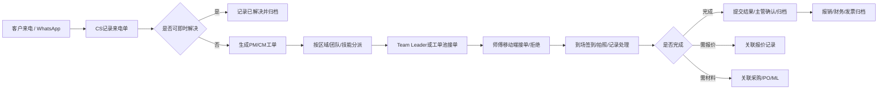

# 业务理解与客户画像

## 客户行业与服务类型

EC InfoTech Limited 是香港本地特低电压（ELV）/弱电/楼宇智能系统服务商。官网显示其为香港客户提供特低电压解决方案，服务包括安装及维修保养，覆盖中央控制及监察、保安、停车场、会所管理、公共天线、卫星电视共用天线等系统。会议材料进一步补充了CCTV、门禁、车闸/停车场、消防报警、公共广播、影音、会所管理、车充、政府及私营项目的安装与维护场景。来源：W1、M1、M4、I21-I31。

## 典型客户类型

| 客户类型 | 证据 | 工单含义 |
|---|---|---|
| 住宅/屋苑/商场 | 项目清单、报价样张中出现屋苑、楼宇、Twin Towers、住宅/公共设施等地点。来源：I21-I28、I30、I31 | 地址、屋苑、座数、楼层、单位需要结构化，支持同名地点区分。 |
| 商业楼宇/物业管理 | 官网与项目清单涉及楼宇系统、停车场、会所管理。来源：W1、I31 | 常见为维修、保养、设备更换、报价、发票归档。 |
| 政府/公营机构 | 纪要提到EMSC/机电署专门流程；纸质报价有EMSD、惩教署等。来源：M6、I22、I26、I29 | 需要政府合约编号规则、特殊资料/邮件对接、可能不可拍照。 |
| 医院/纪律部队/特殊场所 | 纪要明确监狱等特殊场所不可拍照；报价样张出现Tung Tau Correctional Institution。来源：M5、I26 | 客户档案需要“是否可拍照/影像限制”配置。 |
| 供应商/外判商 | 项目和采购流程涉及Supplier、PO、Material Request、ML。来源：M4、M6、I29、I31 | 一期只做采购关联，不开放完整供应商门户。 |

## 核心业务链路

来源：M4、M5、M6、I4、I8、I10、I16、I29、I31。

## 当前使用工具

| 工具 | 当前使用方式 | 问题 |
|---|---|---|
| WhatsApp | 客户/内部沟通、转发工单、提交员工纸/现场照片、搜索Reference No. | 信息分散，漏传、延误、责任不清，照片难归档。来源：M2、M4、M6、I8、I13、I28 |
| 固定电话 | 客户来电报修/查询，CS手工记录。 | 来电依赖纸质单，后续转派和状态追踪断裂。来源：M6、I4、I14 |
| 纸质表单 | Daily Service Call Form、Service Report、Job Completion、Invoice、Quotation、PO。 | 字段分散、重复录入、纸质归档和查询成本高。来源：I4、I10、I16、I21-I31 |
| Excel/文件夹 | Outstanding Project List、项目/报价/客户确认清单、仓库/财务导出。 | 编号、状态、客户/地址检索不统一，难实时协同。来源：M1、M4、I6、I18、I31 |
| 现有系统/旧系统 | 曾覆盖部分功能，尝试嵌入维修保养、采购、报价。 | 速度慢、上传照片慢、存储压力大，曾暂停使用。来源：M1 |
| 钉钉 | 当前用于考勤、公告、OA、文档、部分项目管理。 | 版本、账号数量、存储容量、宜搭采购与配置需确认。来源：M1、M3、M5 |

## 当前痛点

| 痛点 | 业务表现 | 来源 |
|---|---|---|
| 漏单与责任不清 | WhatsApp/人工转派依赖中介人，未及时响应时缺少升级提醒。 | M2、M6 |
| 状态不透明 | 管理层无法知道工单卡在检查、材料、报价、客户确认哪一步。 | M5、I6、I18 |
| 系统复杂，师傅不愿录入 | 旧系统界面复杂，导致一线放弃使用，数据缺失。 | M2 |
| 照片和资料分散 | 现场照片、员工纸、Job Completion散在WhatsApp和文件夹。 | M4、I8、I11、I12、I28 |
| 编号混乱 | 项目、工单、PO、SR、ML等编号需要统一规则和可追溯关联。 | M4、M6、I18、I29、I31 |
| 采购/报价/财务脱节 | 采购依据材料申请和照片，报价确认后不可随意改，财务需报价单+员工纸+照片开票。 | M4、I9、I21-I31 |
| 图片存储与性能 | 月度大量图片上传，旧系统速度慢且存储压力大。 | M1 |
| 账号和权限 | 公司近800人，当前通讯录上限500；离职账号保留与数据归档未定。 | M5 |

## 产品设计原则

1. 一期只做工单闭环，报销、采购、报价只做关联和最小可用入口，不做完整ERP/HR/WMS。
2. 师傅移动端首屏极简：我的待办、接单/拒绝、到场、拍照、填写结果、完成。
3. PC端服务CS、Team Leader、管理层和财务，不把复杂后台暴露给一线。
4. 所有状态、编号、照片、操作人、时间点必须可追溯。
5. 凡材料未确认的流程，标为待确认，不在一期强行固化。
