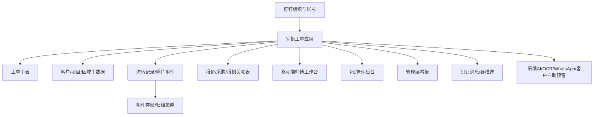

# 技术方案与实施计划

## 1. 推荐架构

## 2. 实施方案对比

| 方案 | 说明 | 优点 | 缺点 | 推荐度 |
|---|---|---|---|---|
| 方案A：钉钉 + 宜搭低代码 | 用钉钉组织、消息、移动端入口，宜搭承载工单表单、流程、权限和看板。 | 上线快、适合MVP、移动端天然支持、客户已有钉钉基础。 | 复杂图片处理、复杂权限、性能上限需POC验证。 | 高 |
| 方案B：钉钉 + 自研Web系统 | 钉钉作为账号和消息入口，核心业务用自研Web/数据库实现。 | 扩展性强、性能和外部接口更可控、适合复杂AI/WhatsApp/客户门户。 | 工期长、成本高、上线慢，对运维要求更高。 | 中，适合二期或宜搭能力不足时 |
| 方案C：HTML原型 + POC | 先做HTML原型确认流程，再用宜搭做小范围POC验证。 | 成本低、快速确认流程、适合签约前演示、能提前暴露字段和移动端问题。 | 不是正式生产系统，不能替代真实权限/数据/性能验证。 | 最高，建议当前先做 |

## 3. 建议路线

HTML原型确认流程 → 宜搭POC → 一期MVP上线 → 二期增强。

当前阶段建议先做HTML原型，把CS建单、Leader派单、师傅移动端、工单详情和管理看板确认清楚；随后用一个区域做宜搭POC，重点验证图片上传、权限、通知、查询和状态流转。

## 4. 钉钉组织与账号

| 设计项 | 建议 |
|---|---|
| 账号模式 | 企业账号统一分配，所有操作绑定个人ID，禁止共用账号。 |
| 人数版本 | 近800人超过500通讯录上限，需确认专业版/专属版。 |
| 组织结构 | 至少维护CS、CR、PM/CM团队、Team Leader、报价、采购、财务、管理层、系统管理员。 |
| 离职处理 | 历史记录保存人员ID、姓名、部门快照；离职后账号可禁用但不影响历史工单。 |

来源：M3、M5。

## 5. 宜搭应用

建议建立一个“EC工单系统”宜搭应用。一期P0包含工单、客户、团队区域、照片附件、流转记录、基础查询和权限日志；P1可选Outstanding看板、超时提醒、简版报销关联；P2仅预留报价、采购、客户自助查询字段。PC端面向CS/Leader/管理层；移动端面向师傅。来源：M2、M4、M5、M6。

## 6. 工单数据表

详见 [05-data-model.md](05-data-model.md)。核心原则：工单主表只保存当前状态和关键字段，所有过程动作进入流转记录表，照片独立附件表，报价/采购/报销用关联表避免一期复杂化。

## 7. 客户/项目/区域主数据

| 主数据 | 用途 |
|---|---|
| 客户档案 | 客户名称、英文别名、联系人、电话、是否可拍照、特殊要求。 |
| 地址/屋苑 | 标准繁体中文名称、英文别名、区域、区域码、坐标/地图点。 |
| 项目/合约 | 项目编号、合约类型、政府/小区类型、客户、有效期、负责人。 |
| 团队/区域 | 区域码、Team Leader、师傅、可接单类型、默认派单规则。 |

## 8. 附件/照片存储

| 策略 | 建议 |
|---|---|
| 上传入口 | 移动端拍照上传，支持从相册补传。 |
| 分类 | 现场前、现场后、故障细节、材料/设备、签名/员工纸、其他。 |
| 压缩 | 移动端上传前或服务端压缩，保留必要清晰度。 |
| 数量 | 一期默认每工单最多20张，可按客户需求调整。M4提到before/after最多各10张。 |
| 归档 | 完成/归档后按月份/项目导出备份，降低在线空间压力。 |

## 9. 通知与钉钉群推送

| 事件 | 通知 |
|---|---|
| 新工单创建 | CS本人、Team Leader、区域群。 |
| 工单分派 | 师傅钉钉待办/消息。 |
| 拒单 | Team Leader和CS。 |
| 超时未接单 | Team Leader，必要时上级。 |
| 等待报价/材料 | 报价/采购负责人。 |
| 待主管确认 | Team Leader。 |

## 10. 权限模型

| 角色 | 数据范围 | 操作 |
|---|---|---|
| CS | 本人创建、客户服务相关、未归档工单 | 创建、补充、取消、查看 |
| CR | 投诉/客户关系相关工单 | 创建、跟进、转派建议 |
| Team Leader | 本区域/本团队 | 分派、改派、退回、确认完成 |
| 师傅 | 本人待办、本人已接、开放工单池（P1启用时） | 接单、拒单、上传、提交 |
| 报价人员 | 等待报价/自己负责 | 填报价关联、更新报价状态 |
| 采购人员 | 等待材料/采购关联 | 填PO/ML、到货状态 |
| 财务 | 已完成/报销/归档相关 | 查看、导出、标记归档 |
| 管理层 | 全局或授权范围 | 看板、导出 |
| 管理员 | 全量 | 配置、审计 |

## 11. 报表看板

一期看板按P0/P1分级：

| 看板 | 指标 |
|---|---|
| 工单总览（P0） | 今日新增、待处理、已接单、处理中、已完成、取消。 |
| 区域/团队（P0） | 各区域待办、处理中、已完成、负责人。 |
| Outstanding（P1） | 按等待报价、等待材料、等待客户确认、施工中、待主管确认分类。 |
| 超时提醒（P1） | 未接单超时、待确认超时、等待材料/报价超时。 |
| 师傅移动端完成率 | 接单数、完成数、拒单数、照片完整率。 |
| 采购/报价关联（P2字段统计） | 等待报价数量、等待材料数量、PO到货状态。 |

## 12. 接口与集成预留

| 集成 | 一期 | 后续 |
|---|---|---|
| 钉钉通讯录 | 读取人员、部门、角色。 | 离职归档策略自动化。 |
| 钉钉消息通知 | 工单分派、超时提醒、待确认。 | 群机器人/高级通知策略。 |
| 宜搭数据导入导出 | Excel模板导入客户/地址/人员/历史工单。 | 定期同步旧系统/财务系统。 |
| WhatsApp | 手动录入和附件上传。 | API/截图识别自动建单。 |
| AI/OCR | 预留附件字段。 | 报销、发票、PO、政府订单识别。 |
| 客户自助查询 | 预留外部查询编号。 | QR/公开链接/客户门户。 |

## 13. 数据安全与权限

1. 敏感客户如监狱/纪律部队标记“不可拍照/限制外发”。
2. 外部公开链接默认不开启；若开启需有效期、访问码和只读范围。
3. 所有导出留痕。
4. 图片和附件按权限控制，不允许师傅查看非本人或非本组敏感工单。
5. 离职人员账号禁用后，历史工单仍保留人员快照。

## 14. 存储与性能建议

| 项目 | 建议 |
|---|---|
| 图片大小 | 移动端默认压缩到可读但不超大；原图只在必要场景保留。 |
| 列表加载 | 师傅只加载本人待办和近期工单；PC分页查询。 |
| 附件归档 | 每月/每季度导出归档到本地或企业云盘。 |
| POC压测 | 用真实手机、真实网络、真实照片数量验证。 |
| 容量采购 | 按月新增工单数、每单照片数、单张压缩后大小估算年度容量。 |

## 15. 实施阶段

| 阶段 | 周期 | 目标 |
|---|---:|---|
| POC | 7-10个工作日 | 验证表单、移动端、照片、派单、看板、权限。 |
| 一期MVP | 4-6周 | 上线工单闭环和最小关联模块。 |
| 二期增强 | 6-10周 | 报价/采购/报销深化、版本控制、更多报表。 |
| 三期AI/自动化 | 视接口和预算 | OCR、WhatsApp、客户自助、知识库。 |
