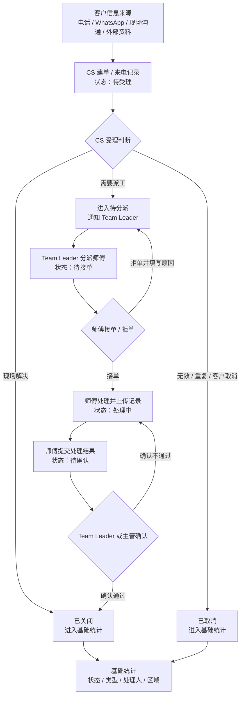
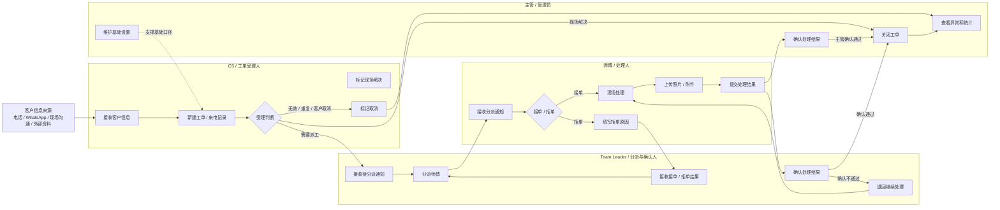
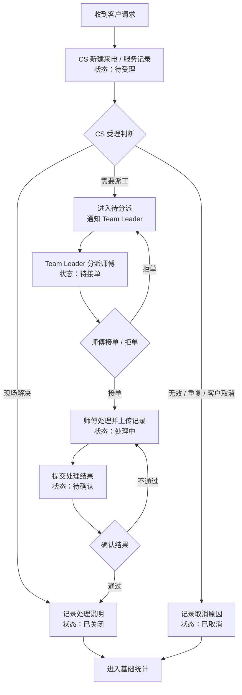
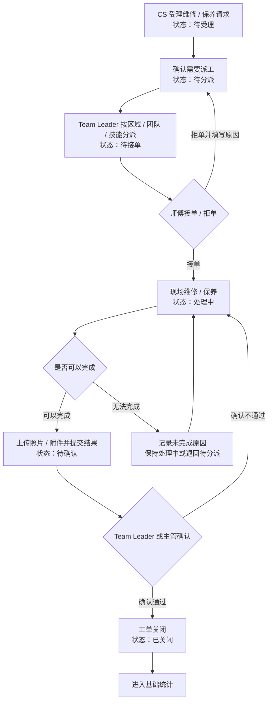
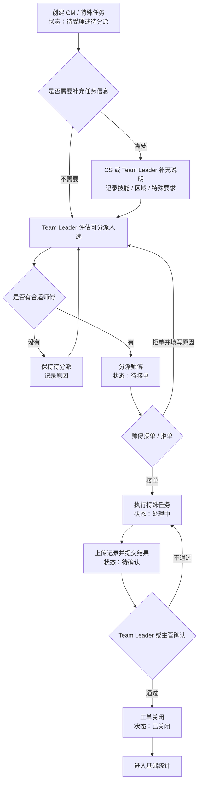
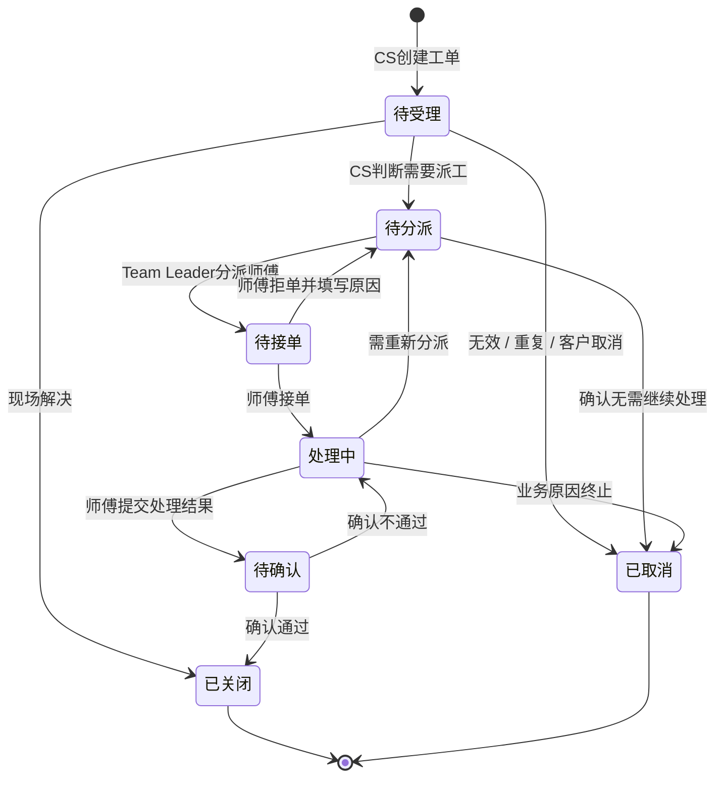
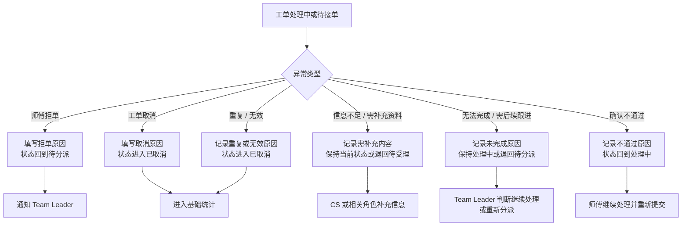

# EC 工单系统流程分析文档

**版本**: 1.0.0  
**日期**: 2026-06-13  
**阶段**: 业务流程分析与流程图阶段；不写代码、不生成 HTML 原型、不做数据库设计、不做接口设计。  
**输入依据**: `.specify/memory/constitution.md`、`docs/01-requirements-spec.md`、`docs/01-requirements-clarification.md`、`docs/01-requirements-analysis.md`、`materials` 客户资料。

## 1. 流程分析目标

本文件用于把 `docs/01-requirements-spec.md` 中已经收敛的 MVP 需求，转化为客户可确认、原型可落地、开发可拆分的业务流程依据。

本文件只围绕以下固定 MVP 范围展开：

- 1 条主流程：CS 建单 / 来电记录 -> CS 受理 -> Team Leader 分派 -> 师傅接单 / 拒单 -> 师傅处理并上传记录 -> Team Leader 或主管确认 -> 工单关闭 -> 基础统计。
- 3 类 MVP 工单：来电 / 服务记录工单、PM / 维修 / 保养类工单、CM / 特殊任务类工单。
- 4 类 MVP 角色：CS / 工单受理人、Team Leader / 分派与确认人、师傅 / 处理人、主管 / 管理员。
- 7 个 MVP 状态：待受理、待分派、待接单、处理中、待确认、已关闭、已取消。

本文件不重新扩大需求范围，不把投诉 / 客户关系、政府 / 合约、报价 / 采购 / 安装、报销 / 考勤、客户自助查询、外部客户自动通知、WhatsApp 自动通知、SLA 超时升级等二期内容画入 MVP 主流程。

## 2. MVP 主流程总览

MVP 主流程是一条内部工单闭环：

CS 建单 / 来电记录  
-> CS 受理  
-> Team Leader 分派  
-> 师傅接单 / 拒单  
-> 师傅处理并上传记录  
-> Team Leader 或主管确认  
-> 工单关闭  
-> 基础统计

主流程图：

主流程说明：

| 流程节点 | 角色 | 触发条件 | 状态流转 | 通知节点 | 结束条件 |
|----------|------|----------|----------|----------|----------|
| CS 建单 / 来电记录 | CS | 收到电话、WhatsApp、现场沟通或外部资料 | 新记录 -> 待受理 | 通知 CS 或受理人 | 工单进入待受理 |
| CS 受理 | CS | 工单待受理 | 待受理 -> 待分派 / 已关闭 / 已取消 | 进入待分派时通知 Team Leader | 判断完成 |
| Team Leader 分派 | Team Leader | 工单待分派 | 待分派 -> 待接单 | 通知师傅 | 指定师傅 |
| 师傅接单 / 拒单 | 师傅 | 工单待接单 | 接单：待接单 -> 处理中；拒单：待接单 -> 待分派 | 通知 Team Leader | 接单或退回待分派 |
| 师傅处理并上传记录 | 师傅 | 已接单并开始处理 | 处理中 -> 待确认 | 通知 Team Leader 或主管 | 提交处理结果 |
| Team Leader 或主管确认 | Team Leader、主管 | 工单待确认 | 待确认 -> 已关闭 / 处理中 | 关闭后进入统计 | 确认通过或退回 |
| 工单关闭 | Team Leader、主管 | 确认通过 | 待确认 -> 已关闭 | 不定义外部客户自动通知 | 工单归档 |
| 基础统计 | 主管、Team Leader、CS | 工单关闭或取消，或状态变化 | 不改变状态 | 无独立通知 | 统计可查看 |

## 3. 角色视角泳道流程图

客户 / 提交人不作为 MVP 独立工作台，只作为需求来源或信息来源出现。

角色泳道说明：

| 角色 | 主要动作 | 关键分支 | 注意事项 |
|------|----------|----------|----------|
| CS / 工单受理人 | 建单、受理、标记现场解决、标记取消 | 是否需要派工 | CS 是否可以直接分派需客户确认，MVP 主责建议为 Team Leader |
| Team Leader / 分派与确认人 | 分派、接收拒单、重新分派、确认处理结果 | 拒单后重新分派，确认不通过退回处理 | 是否拥有关闭权限范围需客户确认 |
| 师傅 / 处理人 | 接单、拒单、处理、上传记录、提交结果 | 拒单必须填写原因 | 师傅不直接关闭工单，不直接取消工单 |
| 主管 / 管理员 | 查看统计、处理异常、确认 / 关闭、维护基础设置 | 关闭后是否允许重开需确认 | 不跳过流程随意修改处理记录 |

## 4. 三类工单流程

### 4.1 来电 / 服务记录工单

适用场景：客户通过电话、WhatsApp、现场沟通或外部资料提出服务请求，CS 需要先记录并判断是否需要派工。

| 要素 | 内容 |
|------|------|
| 发起方式 | CS 手动录入；客户自助提交不进入 MVP |
| 参与角色 | CS、Team Leader、师傅、主管 |
| 关键字段 | 客户公司、联系人、联系方式、区域、地点、问题描述、附件、是否需要派工 |
| 状态流转 | 待受理 -> 待分派 / 已关闭 / 已取消；如派工则进入待接单、处理中、待确认、已关闭 |
| 通知节点 | 创建后通知 CS 或受理人；进入待分派后通知 Team Leader |
| 结束条件 | 现场解决后已关闭；无效 / 重复 / 客户取消后已取消；派工处理完成后已关闭 |
| 异常处理 | 信息不足由 CS 补充；重复 / 无效进入已取消；需后续处理进入待分派 |

### 4.2 PM / 维修 / 保养类工单

适用场景：常规维修、保养或标准现场服务任务，需要进入派工和现场处理闭环。

| 要素 | 内容 |
|------|------|
| 发起方式 | CS 受理后进入派工；授权内部角色是否可创建需客户确认 |
| 参与角色 | CS、Team Leader、师傅、主管 |
| 关键字段 | 工单类型、客户公司、区域、地点、任务描述、附件、处理人、处理记录 |
| 状态流转 | 待受理 -> 待分派 -> 待接单 -> 处理中 -> 待确认 -> 已关闭 |
| 通知节点 | 待分派通知 Team Leader；分派后通知师傅；提交结果后通知 Team Leader 或主管 |
| 结束条件 | Team Leader 或主管确认通过并关闭 |
| 异常处理 | 师傅拒单退回待分派；无法完成时在处理中记录原因；确认不通过退回处理中 |

### 4.3 CM / 特殊任务类工单

适用场景：无固定执行人、需按技能、区域、空闲情况或特殊要求临时分派的任务。

| 要素 | 内容 |
|------|------|
| 发起方式 | CS 或 Team Leader 创建 / 分派；具体入口需客户确认 |
| 参与角色 | CS、Team Leader、师傅、主管 |
| 关键字段 | 工单类型、特殊任务说明、技能要求、区域、地点、附件、处理记录 |
| 状态流转 | 待受理 / 待分派 -> 待接单 -> 处理中 -> 待确认 -> 已关闭 |
| 通知节点 | 待分派通知 Team Leader；分派后通知师傅；接单 / 拒单通知 Team Leader |
| 结束条件 | Team Leader 或主管确认通过并关闭 |
| 异常处理 | 无合适师傅时保持待分派；拒单后回待分派；需要后续跟进时保持处理中并记录原因 |

## 5. 7 状态流转图

状态机说明：

| 状态 | 进入条件 | 允许操作角色 | 下一状态 |
|------|----------|--------------|----------|
| 待受理 | CS 创建工单或来电 / 服务记录 | CS | 待分派、已关闭、已取消 |
| 待分派 | CS 判断需要派工，或师傅拒单退回 | Team Leader；CS 是否可分派需确认 | 待接单、已取消 |
| 待接单 | Team Leader 已分派师傅 | 师傅、Team Leader | 处理中、待分派 |
| 处理中 | 师傅已接单并开始处理 | 师傅、Team Leader、主管 | 待确认、待分派、已取消 |
| 待确认 | 师傅提交处理结果 | Team Leader、主管 | 已关闭、处理中 |
| 已关闭 | Team Leader 或主管确认通过 | Team Leader、主管 | 无；是否允许重开需确认 |
| 已取消 | 无效、重复、客户取消或无需处理 | CS、Team Leader、主管 | 无；是否允许恢复需确认 |

状态流转图：

状态规则：

- 拒单后回到“待分派”，拒单不是独立状态。
- 处理完成后进入“待确认”，不进入独立“已完成”状态。
- 确认后进入“已关闭”。
- 无效、重复、客户取消、无需处理进入“已取消”。
- 客户补充资料不是主状态，只作为处理记录、备注动作或异常原因。

## 6. 通知节点分析

MVP 只定义内部通知节点，通知渠道待客户确认。

| 序号 | 通知节点 | 触发条件 | 通知对象 | 通知内容 | 是否 MVP |
|------|----------|----------|----------|----------|----------|
| 1 | 工单创建后通知 CS 或受理人 | CS 创建工单，状态进入待受理 | CS 或受理队列 | 工单编号、客户、问题摘要 | 是 |
| 2 | 工单进入待分派后通知 Team Leader | CS 判断需要派工，状态进入待分派 | Team Leader | 工单编号、类型、区域、问题摘要 | 是 |
| 3 | 工单分派后通知师傅 | Team Leader 分派，状态进入待接单 | 师傅 | 工单详情、地点、处理要求 | 是 |
| 4 | 师傅接单 / 拒单后通知 Team Leader | 师傅接单或拒单 | Team Leader | 接单结果或拒单原因 | 是 |
| 5 | 师傅提交处理结果后通知 Team Leader 或主管 | 师傅提交处理结果，状态进入待确认 | Team Leader 或主管 | 完成说明、附件、处理结果 | 是 |
| 6 | 工单关闭后进入统计 | 工单状态进入已关闭 | Team Leader、主管、统计页面 | 工单关闭结果进入基础统计 | 是，作为内部记录 |

不作为 MVP 确定功能：

- 外部客户自动通知。
- WhatsApp 自动通知。
- SLA 超时升级。
- 多渠道通知规则。

以上内容只能作为“待客户确认”或“二期候选”。

## 7. 异常流程

### 7.1 异常流程总图

### 7.2 异常流程明细

| 异常流程 | 触发条件 | 操作角色 | 状态变化 | 通知对象 | 记录要求 | 结束条件 |
|----------|----------|----------|----------|----------|----------|----------|
| 师傅拒单流程 | 工单待接单，师傅不能或不愿接单 | 师傅、Team Leader | 待接单 -> 待分派 | Team Leader | 拒单原因、拒单时间、拒单人 | Team Leader 重新分派或取消 |
| 工单取消流程 | 工单无效、客户取消、业务原因终止 | CS、Team Leader、主管 | 待受理 / 待分派 / 处理中 -> 已取消 | 相关内部角色；渠道待确认 | 取消原因、取消人、取消时间 | 工单进入已取消并进入统计 |
| 信息不足 / 需补充资料流程 | 客户信息、地点、问题描述、附件不足 | CS、Team Leader、师傅 | 原则上不新增主状态；保持待受理或处理中 | CS 或相关责任人 | 缺失内容、补充说明、补充时间 | 信息补齐后继续受理或处理 |
| 无法完成 / 需要后续跟进流程 | 材料不足、客户不在场、现场限制、需后续安排 | 师傅、Team Leader | 处理中 -> 处理中 / 待分派 | Team Leader | 未完成原因、现场说明、附件 | 继续处理、重新分派或取消 |
| 重复工单 / 无效工单流程 | CS 或 Team Leader 判断工单重复或无效 | CS、Team Leader、主管 | 待受理 / 待分派 -> 已取消 | 相关内部角色；渠道待确认 | 重复编号、无效原因、处理说明 | 工单进入已取消 |
| 处理完成但确认不通过流程 | Team Leader 或主管认为资料不足或处理结果不合格 | Team Leader、主管、师傅 | 待确认 -> 处理中 | 师傅 | 不通过原因、补充要求、确认人 | 师傅补充处理并重新提交 |

### 7.3 异常流程规则

- 不新增 MVP 主状态承接异常，优先使用记录、备注、原因字段表达。
- 拒单必须有原因，并通知 Team Leader。
- 取消必须有原因，并进入已取消。
- 确认不通过必须写明原因，并回到处理中。
- 信息不足不作为“待客户补充”主状态，除非客户后续明确确认。

## 8. 页面与流程节点映射

| 页面名称 | 对应流程节点 | 使用角色 | 核心操作 | 核心状态 | 是否 MVP 必须 |
|----------|--------------|----------|----------|----------|---------------|
| 工单看板 / 首页 | 基础统计、待处理入口 | CS、Team Leader、主管 | 查看状态数量、进入待处理列表、查看统计 | 待受理、待分派、待接单、处理中、待确认、已关闭、已取消 | 是 |
| 工单列表 | 查询、筛选、进入详情 | CS、Team Leader、师傅、主管 | 搜索、筛选、查看详情 | 全部 7 个状态 | 是 |
| 新建工单 / 来电记录 | CS 建单 / 来电记录、CS 受理 | CS | 新建、提交、标记现场解决、标记取消、进入待分派 | 待受理、待分派、已关闭、已取消 | 是 |
| 工单详情 / 处理记录 | 全流程查看、记录、附件、状态历史 | CS、Team Leader、师傅、主管 | 查看信息、补充记录、上传附件、按角色操作 | 全部 7 个状态 | 是 |
| 分派与接单视图 | Team Leader 分派、师傅接单 / 拒单、重新分派 | Team Leader、师傅 | 分派、重新分派、接单、拒单 | 待分派、待接单、处理中 | 是 |
| 统计报表 | 基础统计 | Team Leader、主管 | 查看总数、状态统计、类型统计、处理人 / Team Leader 统计、区域统计 | 已关闭、已取消及当前未完结状态 | 是 |
| 基础设置，简化版 | 支撑类型、区域、角色、附件规则 | 主管 / 管理员 | 维护基础类型、区域、角色、是否允许拍照等口径 | 不直接改变工单状态 | 是，需简化 |

页面映射原则：

- 页面必须服务流程确认，不做无依据视觉展示。
- 所有菜单、按钮、字段、状态、提示语默认使用中文。
- 客户门户、CR 工作台、采购 / 仓库工作台、财务工作台、HR 工作台不进入 MVP 原型。

## 9. 客户确认问题

从流程角度，进入可研或 HTML 原型前建议优先向客户确认以下 10 个问题：

| 优先级 | 问题 | 影响范围 |
|--------|------|----------|
| 1 | CS 是否一定是唯一建单入口？ | 影响新建工单页面、权限和流程起点。 |
| 2 | Team Leader 是否一定负责分派和确认？ | 影响角色权限、泳道流程和确认节点。 |
| 3 | 师傅拒单是否必须填写原因？ | 影响拒单流程、通知和记录要求；建议必须填写。 |
| 4 | 关闭是否需要客户确认？ | MVP 默认不需要客户确认；若需要，会影响状态和页面。 |
| 5 | 已关闭后是否允许重开？ | 影响状态机和审计记录。 |
| 6 | 已取消是否进入统计？ | 建议进入基础统计，便于管理无效 / 重复 / 取消数量。 |
| 7 | PM 和 CM 的最终定义是什么？ | 影响工单类型、字段、筛选和统计口径。 |
| 8 | 通知渠道到底用什么？ | 影响流程图通知节点和后续可研，不影响当前 MVP 内部通知逻辑。 |
| 9 | 附件 / 照片是否必填？ | 影响师傅处理页面、验收标准和特殊客户规则。 |
| 10 | 移动端是否必须优先适配？ | 影响 HTML 原型页面结构，尤其是师傅接单、上传照片和提交结果。 |

## 10. 下一步建议

完成本流程分析后，建议下一步按以下顺序推进：

1. 先拿 `docs/02-ticket-flow-analysis.md` 中的主流程图、三类工单流程图和状态流转图给客户确认。
2. 客户确认主流程后，生成 `docs/03-feasibility.md` 可研分析，重点评估通知渠道、移动端适配、附件上传、权限控制、状态流转和后续开发风险。
3. 可研分析完成后，再生成 HTML 原型页面结构说明，覆盖 7 个 MVP 页面。

不建议在客户确认流程图前直接进入 HTML 原型。流程节点、确认人、通知渠道、附件必填规则和移动端优先级一旦变更，原型会发生明显返工。

## 交付自检

| 自检项 | 结果 |
|--------|------|
| 主流程图是否完成 | 已完成 |
| 角色视角泳道流程图是否完成 | 已完成 |
| 三类工单流程图是否完成 | 已完成 |
| 7 状态流转图是否完成 | 已完成 |
| MVP 内部通知节点是否完成 | 已完成 |
| 异常流程是否完成 | 已完成 |
| 页面与流程节点映射是否完成 | 已完成 |
| 是否混入二期主流程 | 否 |
| 是否可以进入可研分析 | 可以，建议先客户确认流程图 |
| 是否可以进入 HTML 原型阶段 | 有条件可以，建议先完成客户确认和可研分析 |
