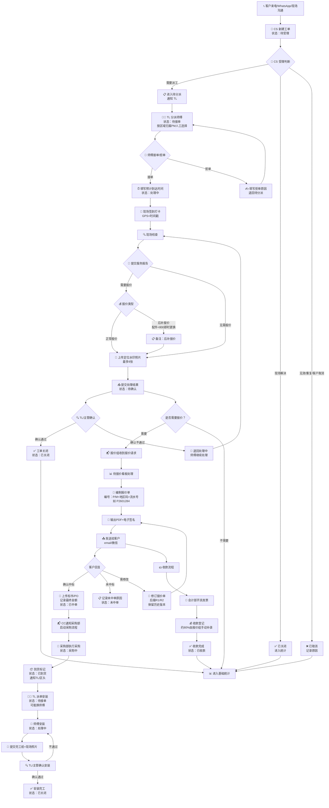
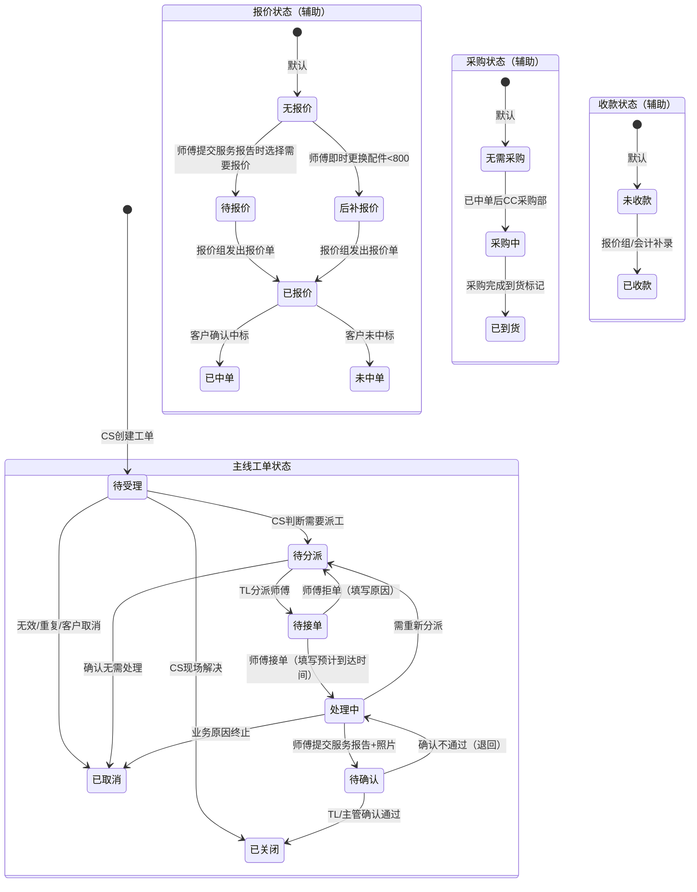
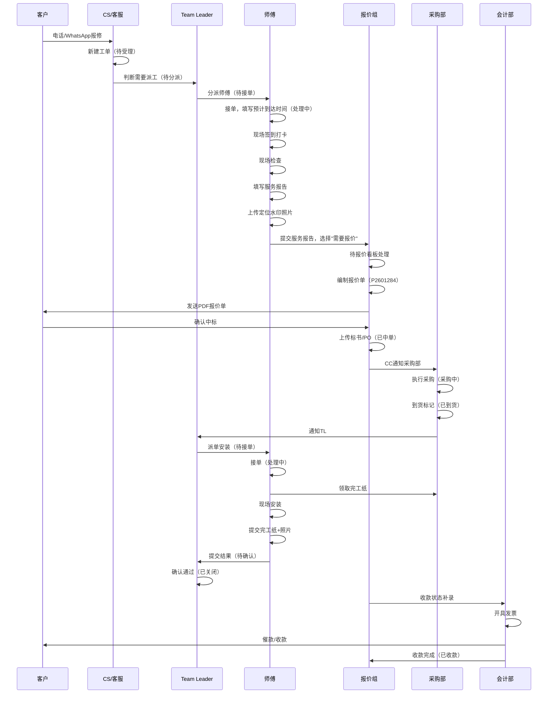
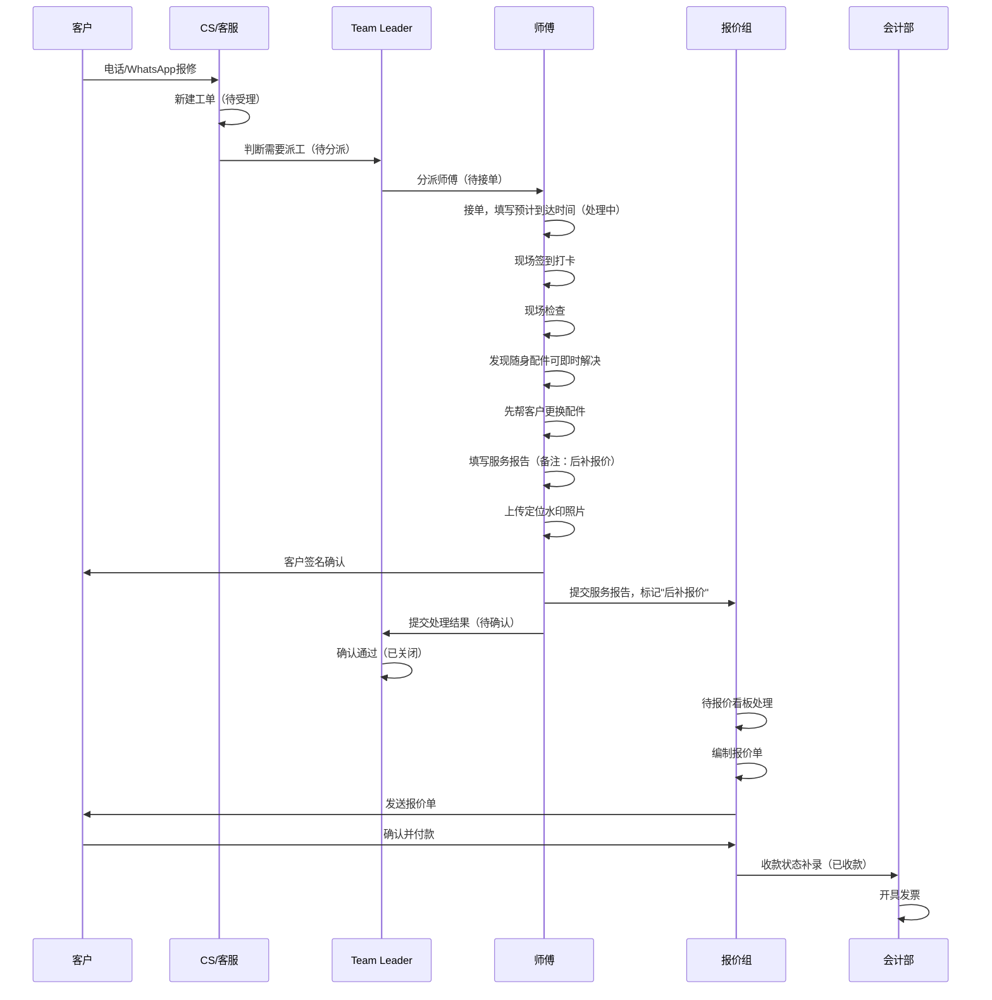

# ECInfo 工单系统完整流程文档

**版本**: 2.0.0  
**日期**: 2026-06-29  
**依据**: 0625 听记纪要、01-requirements-spec.md、02-ticket-flow-analysis.md

---

## 一、角色体系（完整版）

| 角色 | 代号 | 核心职责 | 备注 |
|------|------|----------|------|
| CS / 客服 | CS | 接收客户需求，建单，受理判断，记录催办 | 工单入口 |
| Team Leader / PM | TL | 分派工单，确认处理结果，区域负责人 | 即 PM（项目负责人） |
| 师傅 / 维修人员 | Master | 接单/拒单，现场处理，提交服务报告，发起报价 | 技能不用于派单筛选 |
| CR / 客户关系 | CR | 查看报价信息，协调复杂客户关系 | 不作为独立工作台 |
| 报价组 | QUO | 报价编制，报价单生成，收款补录，标书管理 | 邹义负责对接 |
| 采购部 | PUR | 采购执行，到货通知，完工纸制作 | 有独立系统 |
| 会计部 | FIN | 发票开具，催款，收款登记 | 不实时更新系统 |
| 主管 / 管理员 | Admin | 统计报表，基础设置，全局监控 | 可确认关闭工单 |
| Supervisor | Supervisor | 查看工单，确认关闭，统计报表 | - |
| HR | HR | 提供维修人员名单、归属PM、Special Team名单 | 不进入工单流程 |
| Special Team | SP | 特殊任务执行，可双重归属 | 按任务类型区分优先级 |

---

## 二、工单主线状态（7个）

| 状态 | 进入条件 | 操作角色 | 下一状态 |
|------|----------|----------|----------|
| 待受理 | CS 创建工单 | CS | 待分派/已关闭/已取消 |
| 待分派 | CS 判断需要派工 / 师傅拒单 | TL | 待接单/已取消 |
| 待接单 | TL 分派师傅 | 师傅 | 处理中/待分派 |
| 处理中 | 师傅接单 | 师傅 | 待确认/待分派/已取消 |
| 待确认 | 师傅提交服务报告/完工纸 | TL/主管 | 已关闭/处理中 |
| 已关闭 | TL/主管确认通过 | - | - |
| 已取消 | 无效/重复/客户取消 | CS/TL/主管 | - |

---

## 三、辅助字段（商务进度追踪）

| 字段 | 可选值 | 维护人 | 说明 |
|------|--------|--------|------|
| 报价类型 | 无/正常报价/后补报价 | 师傅 | 提交服务报告时选择 |
| 报价状态 | 无/待报价/已报价/已中单/未中单 | 报价组 | 报价组维护 |
| 采购状态 | 无/采购中/已到货 | 采购部 | 到货后触发安装 |
| 收款状态 | 无/已收款 | 报价组/会计 | 收款完成后标记 |

---

## 四、完整主流程图

---

## 五、角色泳道图

```mermaid
flowchart LR
    %% ===== CS 泳道 =====
    subgraph CS_LANE["📋 CS / 客服"]
        C1["📞 接收客户请求"]
        C2["📝 新建工单<br/>状态：待受理"]
        C3{"🤔 受理判断"}
        C4["✅ 现场解决→已关闭"]
        C5["❌ 无效/重复→已取消"]
        C6["📋 记录催办"]
    end

    %% ===== TL 泳道 =====
    subgraph TL_LANE["👔 Team Leader / PM"]
        T1["📬 收到待分派通知"]
        T2["👀 查看待分派工单"]
        T3["👨‍🔧 选择师傅并分派<br/>状态：待接单"]
        T4["📬 收到接单/拒单通知"]
        T5{"🔍 确认处理结果<br/>状态：待确认"}
        T6["✅ 确认通过→已关闭"]
        T7["🔄 退回处理"]
        T8["👨‍🔧 派单安装<br/>到货后重新分派"]
    end

    %% ===== 师傅泳道 =====
    subgraph MASTER_LANE["🔧 师傅 / 维修人员"]
        M1["📬 收到分派通知<br/>状态：待接单"]
        M2{"🤔 接单/拒单"}
        M3["⏰ 接单：填写预计到达时间<br/>状态：处理中"]
        M4["✍️ 拒单：填写原因"]
        M5["📍 现场签到打卡"]
        M6["🔍 现场检查"]
        M7{"📝 提交服务报告"}
        M8["📸 上传定位水印照片"]
        M9{"💰 是否需要报价？"}
        M10["📋 备注：后补报价"]
        M11["📤 提交处理结果"]
        M12["🔧 安装作业"]
        M13["📄 提交完工纸+照片"]
    end

    %% ===== 报价组泳道 =====
    subgraph QUO_LANE["💰 报价组"]
        Q1["📬 收到报价请求"]
        Q2["📊 待报价看板处理"]
        Q3["📝 编制报价单"]
        Q4["📄 输出PDF+电子签名"]
        Q5["📤 发送客户"]
        Q6["📬 收到客户确认"]
        Q7["📸 上传标书/PO"]
        Q8["💵 收款状态补录"]
    end

    %% ===== 采购部泳道 =====
    subgraph PUR_LANE["📦 采购部"]
        P1["📬 收到CC通知"]
        P2["🛒 执行采购"]
        P3["📦 到货标记+通知"]
        P4["📄 制作完工纸"]
    end

    %% ===== 会计部泳道 =====
    subgraph FIN_LANE["🏦 会计部"]
        F1["🧾 开具发票"]
        F2["💰 收款登记"]
    end

    %% ===== 主管泳道 =====
    subgraph ADMIN_LANE["👑 主管/管理员"]
        A1["📊 查看统计报表"]
        A2["🔍 确认处理结果"]
        A3["📈 查看中单率报表"]
    end

    %% ===== 连接线 =====
    C1 --> C2 --> C3
    C3 -->|需要派工| T1
    C3 -->|现场解决| C4 --> A1
    C3 -->|无效/重复| C5 --> A1
    C6 -.->|催办通知| T2

    T1 --> T2 --> T3 --> M1
    M1 --> M2
    M2 -->|接单| M3 --> M5 --> M6 --> M7
    M2 -->|拒单| M4 --> T2
    T4 -->|拒单通知| T2

    M7 -->|需要报价| M9
    M7 -->|无需报价| M8 --> M11
    M9 -->|正常报价| M8 --> M11
    M9 -->|后补报价| M10 --> M8 --> M11

    M11 --> T5
    M11 --> A2
    T5 -->|确认通过| T6 --> A1
    T5 -->|不通过| T7 --> M6
    A2 -->|确认通过| T6
    A2 -->|不通过| T7

    M11 -->|需要报价| Q1
    Q1 --> Q2 --> Q3 --> Q4 --> Q5
    Q5 -->|客户确认| Q6 --> Q7
    Q7 -->|需要采购| P1
    Q7 -->|无需采购| Q8

    P1 --> P2 --> P3
    P3 -->|通知TL| T8
    T8 --> M1
    P3 --> P4

    P4 --> M12 --> M13
    M13 --> T5

    Q8 --> F1 --> F2
    T6 --> A3
    Q6 --> A3
```

---

## 六、状态流转图

---

## 七、两种报价场景详细流程

### 场景一：正常报价流程

### 场景二：后补报价流程（配件 < $800）

---

## 八、通知机制（完整版）

| 序号 | 触发条件 | 通知对象 | 通知内容 |
|------|----------|----------|----------|
| 1 | CS 创建工单 | CS | 工单编号、客户、问题摘要 |
| 2 | 进入待分派 | TL | 工单编号、类型、区域 |
| 3 | TL 分派后 | 师傅 | 工单详情、地点、处理要求 |
| 4 | 师傅接单/拒单 | TL | 接单结果/拒单原因 |
| 5 | 师傅提交服务报告 | TL/主管 | 完成说明、附件 |
| 6 | 工单关闭 | TL/主管 | 进入统计 |
| 7 | 师傅发起报价 | 报价组 | 报价请求信息 |
| 8 | 报价完成发送 | CS/CR | 报价结果（可查看） |
| 9 | 客户中标确认 | 采购部(CC) | 启动采购 |
| 10 | 到货 | TL/师傅 | 物料已到达 |
| 11 | 客户催办 | TL/师傅 | 催办内容，多次催办提升优先级 |
| 12 | 每日9点提醒 | 当日有任务的师傅 | 当日待处理工单 |

---

## 九、关键时间节点

| 节点 | 说明 |
|------|------|
| 开单时间 | CS 填写工单的时间，需显式记录 |
| 创建时间 | 系统自动生成 |
| 接单时间 | 师傅接单时间 |
| 预计到达时间 | 师傅接单时填写 |
| 签到时间 | 现场打卡时间 |
| 完成时间 | 师傅提交服务报告时间 |
| 报价时间 | 报价单生成时间 |
| 中单时间 | 客户确认中标时间 |
| 到货时间 | 采购到货标记时间 |
| 完工时间 | 安装完工提交时间 |
| 收款时间 | 收款登记时间 |
| 监控点1 | 10:40 - 处理进度监控 |
| 监控点2 | 16:40 - 处理进度监控 |
| 完工时限 | 收货后两周内必须完工 |

---

## 十、报价编号规则

| 项目 | 说明 |
|------|------|
| 编号结构 | 前缀 + 地区码 + 五位流水号 |
| 示例 | P2601284 |
| 前缀 | P = Project（项目），M = Maintenance Control（维护） |
| 地区码 | 如 260 |
| 流水号 | 如 1284，每年从 00001 起编 |
| 修订版 | 原单号 + R1/R2，如 1285R1、1285R2 |
| 唯一性 | 所有单据从统一 database 提取编号 |

---

## 十一、权限矩阵（完整版）

| 操作 | CS | TL | Master | QUO | PUR | FIN | Admin | Supervisor |
|------|-----|-----|--------|-----|-----|-----|-------|------------|
| 查看工单 | 自己创建的 | 团队/区域 | 分派给自己的 | 相关工单 | 相关工单 | 相关工单 | 全部 | 全部 |
| 新建工单 | ✅ | 可选 | ❌ | ❌ | ❌ | ❌ | 可选 | ❌ |
| 受理工单 | ✅ | 可选 | ❌ | ❌ | ❌ | ❌ | 可选 | ❌ |
| 分派工单 | ❌ | ✅ | ❌ | ❌ | ❌ | ❌ | 可选 | ❌ |
| 接单/拒单 | ❌ | ❌ | ✅ | ❌ | ❌ | ❌ | ❌ | ❌ |
| 填写处理记录 | 补充受理记录 | 补充跟进记录 | ✅ | ❌ | ❌ | ❌ | 补充管理记录 | ❌ |
| 上传附件 | ✅ | ✅ | ✅ | ✅ | ✅ | ✅ | ✅ | ✅ |
| 提交处理结果 | ❌ | 可代处理 | ✅ | ❌ | ❌ | ❌ | ❌ | ❌ |
| 确认处理结果 | ❌ | ✅ | ❌ | ❌ | ❌ | ❌ | ✅ | ✅ |
| 关闭工单 | 建议关闭 | ✅ | ❌ | ❌ | ❌ | ❌ | ✅ | ✅ |
| 取消工单 | 受理阶段 | 分派/处理中 | ❌ | ❌ | ❌ | ❌ | ✅ | ❌ |
| 编制报价单 | ❌ | ❌ | ❌ | ✅ | ❌ | ❌ | ❌ | ❌ |
| 发送报价单 | ❌ | ❌ | ❌ | ✅ | ❌ | ❌ | ❌ | ❌ |
| 执行采购 | ❌ | ❌ | ❌ | ❌ | ✅ | ❌ | ❌ | ❌ |
| 收款登记 | ❌ | ❌ | ❌ | ✅ | ❌ | ✅ | ❌ | ❌ |
| 查看统计 | 基础统计 | 团队/区域 | ❌ | 报价统计 | 采购统计 | 收款统计 | 全局 | 全局 |
| 管理基础设置 | ❌ | ❌ | ❌ | ❌ | ❌ | ❌ | ✅ | ❌ |

---

## 十二、关键决策汇总

| 编号 | 决策内容 | 来源 |
|------|----------|------|
| 1 | 报价时机：必须在师傅现场检查后，不是在派单前 | 0625会议四 |
| 2 | 报价类型：正常报价、后补报价（配件<800即时更换） | 0625会议四 |
| 3 | 安装阶段：仍需TL派单，师傅可能换人 | 0625会议四 |
| 4 | 技能不用于派单筛选，派单按区域归属PM人工选择 | 0625会议一 |
| 5 | 关单≠收款完成，收款状态需另行维护 | 0625会议四 |
| 6 | 约80%收款数据由报价组手动填写 | 0625会议四 |
| 7 | 报价编号统一为"前缀+地区码+五位流水号" | 0625会议三 |
| 8 | 报价修改禁止覆盖原始单，必须保留版本记录 | 0625会议三 |
| 9 | 现阶段不设强制审批流，保持灵活性 | 0625会议三 |
| 10 | 完工时限：收货后两周内必须完工 | 0625会议四 |

---

## 交付自检

| 自检项 | 结果 |
|--------|------|
| 完整主流程图是否完成 | ✅ 已完成 |
| 角色泳道图是否完成 | ✅ 已完成 |
| 状态流转图是否完成 | ✅ 已完成 |
| 两种报价场景是否完成 | ✅ 已完成 |
| 通知机制是否完成 | ✅ 已完成 |
| 权限矩阵是否完成 | ✅ 已完成 |
| 关键时间节点是否完成 | ✅ 已完成 |
| 报价编号规则是否完成 | ✅ 已完成 |
| 关键决策是否完成 | ✅ 已完成 |
