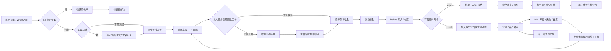

# EC 工单系统：SOP、需求与原型对齐审计

**审计日期**：2026-09-26  
**SOP 来源**：`/Users/xiaoxiangruanjian/Downloads/SOP.jam`  
**需求基线**：`abc/ec-workorder/12-requirements-latest-20260919.md`  
**原型基线**：`prototype/index.html`（原 `ui-prototype2.0`，当前 Git `main / 2e06126`）  
**结论性质**：结构和业务逻辑审计；不是客户需求签字稿，也不是生产验收报告。

> `prototype` 是以 `archive/prototype-1.0` 为交互和业务规则基线制作的 2.0 视觉升级版。本报告后续以 2.0 为原型入口；业务逻辑结论不变。

## 1. 结论先行

当前项目**没有整体做成另一个系统**。核心工单闭环与 SOP 大体同向：

`来电/WhatsApp → CS 判断 → 来电单 → 自动转工单 → 主管/CR 分派 → 师傅接单 → 到场签到 → Before/After → SR 或完工纸 → 报价/采购后续 → 会计`

但现在不能直接按原型继续扩展。存在 5 个会让项目做偏的高风险问题：

1. **角色缺失**：SOP 明确使用 `Project 主管` 和 `仓务部`，当前需求及原型没有独立角色，分别被 TL、PUR/ADMIN 临时代替。
2. **完工状态冲突**：SOP 和原型都是师傅提交 SR/完工单后直接“已完成”；最新需求 F033 又写成“进入待确认或待审批”。同时“待审批”已被原型用于工单池接单申请，语义混在一起。
3. **采购数据归属冲突**：原型一方面写“仓库通单向同步、只读”，另一方面又允许在本系统手工改采购单、供应商、物料和状态。这两种方案不能同时成立。
4. **标书闭环未完成**：SOP 包含“扫描标书 → 自动分类/区域 → 填报价 → 导出标书 → 回标 → 中标后 M/P/M+P 分流”；原型的“回标”和“导出标书”按钮被代码明确关闭，中标后责任人也仍以 TL 占位。
5. **CM 抢占 PM 规则有冲突**：SOP 允许已排程 PM 师傅选择“接受 CM、放弃 PM”或“不接受 CM、继续 PM”；原型在部分带排程标记的 CM 上隐藏“不接受 CM”按钮。

因此，建议现在的动作不是重画整套原型，而是先冻结下文的“统一流程与 5 项决策”，再修需求和原型。报价、标书、采购、会计在决策完成前只能视为讨论稿，不能作为一期已定范围。

## 2. SOP 文件可靠性检查

本次直接解析了 `.jam` 文件的节点和连线，不依赖 Figma 在线编辑权限。

| 检查项 | 结果 | 判断 |
|---|---:|---|
| 全部节点 | 4,610 | 文件完整可读 |
| 流程形状 | 2,061 | 可提取步骤、角色和状态 |
| 连线 | 2,292 | 可追踪流程关系 |
| 独立文字 | 254 | 包含泳道、标题及说明 |
| 连通流程组 | 27 | 多个主流程和复制子流程并存 |
| 两个最大流程组 | 701 / 698 节点 | 两套近似总流程并存，部分责任人不同 |
| 含“？”的节点实例 | 86 | 尚有大量责任主体未定 |
| 不重复的“？”表述 | 32 | 如“?主管”“?会计部”“By ?组” |

两个总流程分别使用“中标后”和“中单后”等不同表述；另有成对复制的 121 节点、115 节点子流程。因此：

- SOP 能证明业务全貌和真实部门协作。
- SOP 不能证明所有责任人、系统边界和版本已经定稿。
- 客户评审时必须指定哪一套总流程为有效版本，其余移到“历史/草稿”区。

结构化提取结果见：

- `.codex/sop-alignment/sop-components.md`
- `.codex/sop-alignment/sop-graph.json`

## 3. 建议采用的统一业务主流程

### 统一状态建议

不要继续把所有业务卡点塞进一个工单主状态。

| 对象 | 建议状态 |
|---|---|
| 来电单 | 仅答疑、投诉跟进、已转工单、已解决 |
| 工单主状态 | 待分派、待接单、待处理、处理中、待完工确认（可配置）、已完成、已取消 |
| 接单申请 | 待审批、已通过、未通过；作为独立“分派申请状态”，不要占用工单主状态“待审批” |
| 业务卡点 | 等待报价、等待材料、等待客户确认；作为卡点/阻塞原因，不建议替代工单主状态 |
| 报价 | 待报价、报价中、已中单、丢单 |
| 采购 | 待下单、已下单、已发货、已到货、已入库、已验收、已取消 |

“待完工确认”是否启用必须由客户确认。如果不启用，师傅提交合格 SR/完工单后直接完成；如果启用，则必须与“接单申请审批”分开命名、分开权限、分开日志。

## 4. 逐流程对齐矩阵

状态说明：`一致`＝SOP、需求与原型逻辑可对上；`部分一致`＝主干一致但存在规则/责任缺口；`冲突`＝三者存在不可同时成立的定义；`缺失`＝SOP 明确要求但原型没有可执行闭环。

| # | 流程 | SOP 依据 | 当前需求 | 当前原型 | 结论 | 必须处理 |
|---:|---|---|---|---|---|---|
| 1 | 来电判断与记录 | CS 可处理则记录并解决；否则建来电单/转工单 | F006–F012 | 有来电记录、仅答疑、需建单自动转工单 | 一致 | 保留 |
| 2 | 投诉升级 | 投诉通知所属 CR、更新现有工单 | F005、F009、F012 | 投诉类型自动通知同区 CR | 一致 | 补充“已有工单时更新，不重复建单”的验收案例 |
| 3 | 分派 | Super/主管分派；CM 可由 CR/CS/Super 重分配 | F014–F023 | TL/CR/ADMIN 可操作；CS 只能看分派页，不能重分配 | 部分一致 | 明确 CS 仅限 CM 重分配，还是完全无派单权 |
| 4 | 团队工单申请接单 | 师傅申请，CR/主管审批 | F023、F076 | 用工单主状态“待审批”承载申请 | 冲突 | 改为独立分派申请状态 |
| 5 | PM/CM 抢占 | 已排程 PM 师傅可接受 CM 或拒绝 CM 继续 PM | F026、F078 | 接受 CM 会退回 PM 并通知重派；部分排程 CM 隐藏拒绝按钮 | 冲突 | 恢复 SOP 选择权，除非客户另有强制规则 |
| 6 | 到场及现场处理 | 准时签到/未按时、Before、维修、After、超时通知 | F026、F029、F075 | 已实现签到、Before/After、超时提醒 | 部分一致 | 生产阈值不能使用原型 1/1/2 分钟演示值；改成配置 |
| 7 | 不可拍照 | SOP 未明确所有例外；历史需求明确特殊场所 | F074 | SR/CP 提交都强制 Before/After | 冲突 | 对不可拍照客户放行并要求原因/替代证明 |
| 8 | SR / 完工单选择 | 即时维修多走 SR；备货施工领取完工纸 | F021、F027–F033 | 根据 MR、PO、物料或报价自动判断；纯 CALL 走 SR | 部分一致 | 用真实样例确认判定表，不能只靠代码推断 |
| 9 | 完工与关单 | 提交扫描 SR/完工纸后显示已完成 | F033 写“待确认或待审批”；Q1 又说可配置 | SR 和 CP 提交直接设为已完成 | 冲突 | 客户只需做一个决定：直接完成，或进入独立“待完工确认” |
| 10 | 后补报价 | SR 提交报价请求，通知报价部及主管 | F030、F040–F045 | 自动创建关联报价并通知 QUO/TL | 一致 | 明确正常报价/后补报价的触发字段 |
| 11 | 报价责任人 | SOP 同时出现 CR 报价和报价部报价两套 | F040 允许 QUO、CR、ADMIN | CR 和 QUO 均有报价入口 | 部分一致 | 按报价类型/区域明确谁负责，不使用“都可以”代替责任规则 |
| 12 | MR、库存与仓务 | CR/Project 建 MR；仓务确认库存、入库、留货、备货、打印完工纸 | F051–F056 只覆盖备货/采购概要 | 无仓务角色，以 PUR/ADMIN 代替；无完整打印和捆绑交接 | 缺失 | 决定“本系统自建仓务流程”或“仓库通接口”，二选一 |
| 13 | 采购状态 | 采购发 PO、收货；仓务入库；业务负责人核对数量 | F051–F056 | 可手动编辑 PO 和推进状态，又声明仓库通只读同步 | 冲突 | 先定数据主系统和可写字段，再开发接口/权限 |
| 14 | 采购后施工 | 备货和完工纸准备好后再分派师傅 | F055–F056 | 验收后可自动新建带 `(2)` 后缀的工单 | 部分一致 | 后缀规则和“新建还是恢复原工单”需客户确认 |
| 15 | 标书导入 | 主动/被动取得标书，扫描，自动分类和区域，通知主管 | F046–F050 | 有模拟扫描、自动分类/区域及通知 | 一致（原型演示） | OCR/扫描仍是模拟，不可算已交付 |
| 16 | 回标 | 填报价表、导出标书、正式回标 | F046–F050 未逐项写清 | 回标和导出按钮被代码关闭 | 缺失 | 新增明确功能与验收，或从当前范围移除 |
| 17 | 中标后 M/P/M+P 分流 | M 归 CR/区域组，P 归 Project 组，M+P 先 P 后 M | F046–F055 未定义完整责任和顺序 | P 用 TL 代替 Project 主管，M+P 的“?组”仍是占位 | 冲突 | 增加 Project 角色和责任矩阵；确认 M+P 先 P 后 M 的串行规则 |
| 18 | 标书排程转工单 | 备货后按排程分派；PM 可周期执行 | F050 | 新工单写有 master，但状态仍是“待分派”，通知又称“已分派” | 冲突 | 有师傅时应进入待接单；无师傅时才是待分派 |
| 19 | 开票与收款 | 客户确认报价后，报价组转会计开票，再收款 | F057–F062 | 有发票/收款模拟流程 | 部分一致 | 明确开票触发是“客户确认/中单”还是“现场完工”，并做真实接口 POC |
| 20 | 报告归档 | SR/完工纸可追溯 | F035–F039、F080 | 有报告文件夹和发送日志原型 | 部分一致 | 缺真实文件存储、保留、备份、恢复及访问权限验证 |

## 5. 代码层面已确认的具体偏差

### P0：不修会影响核心工单闭环

1. **两个建单入口逻辑不统一**  
   `saveWorkOrder()` 使用统一编号生成器并支持政府前缀；另一套 `renderCreate()` 提交逻辑直接拼接 `WO-日期-序号`。同一种业务从不同入口进入可能得到不同编号、默认 TL 和字段结果。应收敛为一个建单服务。

2. **完工提交绕过了需求中的待确认**  
   SR 提交和 CP 提交都直接把工单设为“已完成”。如果客户选择主管确认，必须新增明确状态和动作；如果客户选择直接完成，需求 F033 应同步修改。

3. **不可拍照豁免没有落到提交校验**  
   原型目前无条件要求 Before/After 各至少一张，与 F074 及特殊场所要求冲突。

4. **接单审批复用了工单主状态“待审批”**  
   这会与“完工审批”混淆，统计、权限、通知和历史迁移都会出错。

5. **CM 拒绝规则与 SOP 选择权不一致**  
   需确认“任何 CM 都可拒绝”还是“某类排程 CM 强制接受”。未确认前不应在 UI 隐藏按钮。

### P1/P2：会导致模块范围和集成方向做偏

6. **仓库角色被 PUR/ADMIN 代替**  
   这不是 UI 命名问题，而是职责隔离、审计和数据权限问题。

7. **采购同时存在手工维护与只读同步两套方案**  
   必须先确定仓库通是否是主数据源，再决定本系统哪些字段可写。

8. **标书“回标/导出”仅有处理函数，入口被关闭**  
   当前原型不能证明 SOP 的正式回标闭环已经覆盖。

9. **Project 主管没有独立角色**  
   P 线和 M+P 线被 TL 代替，会使区域主管与项目主管的数据范围混淆。

10. **标书排程生成工单的状态与通知互相矛盾**  
    数据写“待分派”，同时已填师傅并通知“已分派”。生产实现必须只有一种事实。

## 6. 对最新需求清单的修订建议

在客户再次逐条确认前，不建议直接增加更多页面。先修订以下需求表达：

| 需求项 | 当前问题 | 建议修订 |
|---|---|---|
| F023 / F076 | 用工单“待审批”表示申请接单 | 增加独立“分派申请”对象或子状态 |
| F033 | 写成待确认或待审批，但原型直接完成 | 改成二选一可配置规则，并写明默认值和验收案例 |
| F046–F050 | 未完整表达导出标书、回标、中标后 M/P/M+P | 增加步骤、责任人、输入输出和状态 |
| F051–F056 | 仓务/MR/打印完工纸/捆绑留货缺失 | 增加仓务流程，或明确全部由仓库通负责并定义接口 |
| F055–F056 | 自动建新工单和编号后缀来自原型，不是 SOP 定论 | 保持“待确认”，增加“恢复原工单”替代方案比较 |
| F074 | 需求有豁免，原型无校验分支 | 写清豁免来源、审批人、替代证明及审计日志 |
| F078 | 只有 PM/CM 分类映射 | 增加 CM 抢占 PM 的接受、拒绝、替补和通知规则 |
| 角色清单 | 缺 Project、Warehouse | 新增角色，或书面确认由哪个现有角色代理及其边界 |

建议新增客户确认项：

- C11：SOP 哪一套总流程为有效版本，另一套是否作废。
- C12：Project 主管和仓务部是否需要独立系统账号/角色。
- C13：仓库通与本系统的数据主从关系、同步方向和可写字段。
- C14：师傅提交后直接完成，还是必须由主管确认完工。
- C15：标书的导出、回标和中标后 M/P/M+P 是否纳入本期。
- C16：采购完成后是恢复原工单，还是生成新工单；若新建，编号规则是什么。

## 7. 范围防偏移建议

### 一期 P0 应冻结为

- 来电记录、仅答疑、投诉升级、来电单转工单。
- 工单查询、分派/改派、团队工单申请。
- 师傅接单/拒单、CM 抢占 PM、签到、现场处理。
- Before/After 或不可拍照豁免。
- SR/完工单、客户确认、完工规则、报告归档。
- 客户、地点、区域、人员、角色和通知基础数据。

### 未确认前不得自动算入一期

- 完整报价版本控制。
- 标书 OCR、导出、回标和中标后完整 Project 流程。
- MR、库存、仓库通、采购、备货的生产级联动。
- 会计、Peachtree、正式发票和收款接口。
- 自动周期排程、自动建单和跨系统自动通知。

## 8. 建议的下一轮客户评审顺序

只按以下顺序评审，避免再次按页面散点讨论：

1. 确认有效 SOP 版本及角色：CS、CR、主管、Project、师傅、报价、采购、仓务、会计。
2. 确认一条普通 CALL 从来电到完工的状态和责任人。
3. 确认 CM 抢占 PM 的接受/拒绝/替补规则。
4. 确认“不能即时完成”后如何进入报价、MR、采购和第二次施工。
5. 确认 SR 与完工纸的判定，以及师傅提交后是否需要主管确认。
6. 最后确认标书、仓库通、会计是否纳入本期。

只有前 5 项签字后，才适合继续修原型并拆开发任务；第 6 项可以单独作为扩展范围报价。

## 9. 审计健康度

| 步骤 | 健康度 | 说明 |
|---:|---|---|
| 1. 本地 SOP 文件可读性 | 通过 | 已读取节点、连线、泳道和文本 |
| 2. SOP 版本唯一性 | 不通过 | 同画布存在两套近似总流程及大量复制子流程 |
| 3. 责任人完整性 | 不通过 | 86 个节点仍含“？”；Project/仓务角色未落到当前角色模型 |
| 4. 核心 CALL 闭环 | 部分通过 | 主链路一致，但完工确认、不可拍照、CM 拒绝有冲突 |
| 5. 报价/采购闭环 | 部分通过 | 主干存在，数据归属和仓务责任冲突 |
| 6. 标书闭环 | 不通过 | 回标/导出未开放，中标后 P/M 责任未定 |
| 7. 会计与外部接口 | 待 POC | 当前仅可视为模拟原型 |
| 8. 范围稳定性 | 风险高 | 原型已超出原一期边界，必须重新冻结 P0/P1/P2 |

**最终判断**：核心工单方向可以保留；当前最容易做偏的是“角色模型、完工状态、仓库/采购数据归属、标书中标后流程”。先修这四类，再继续美化或扩展原型。
