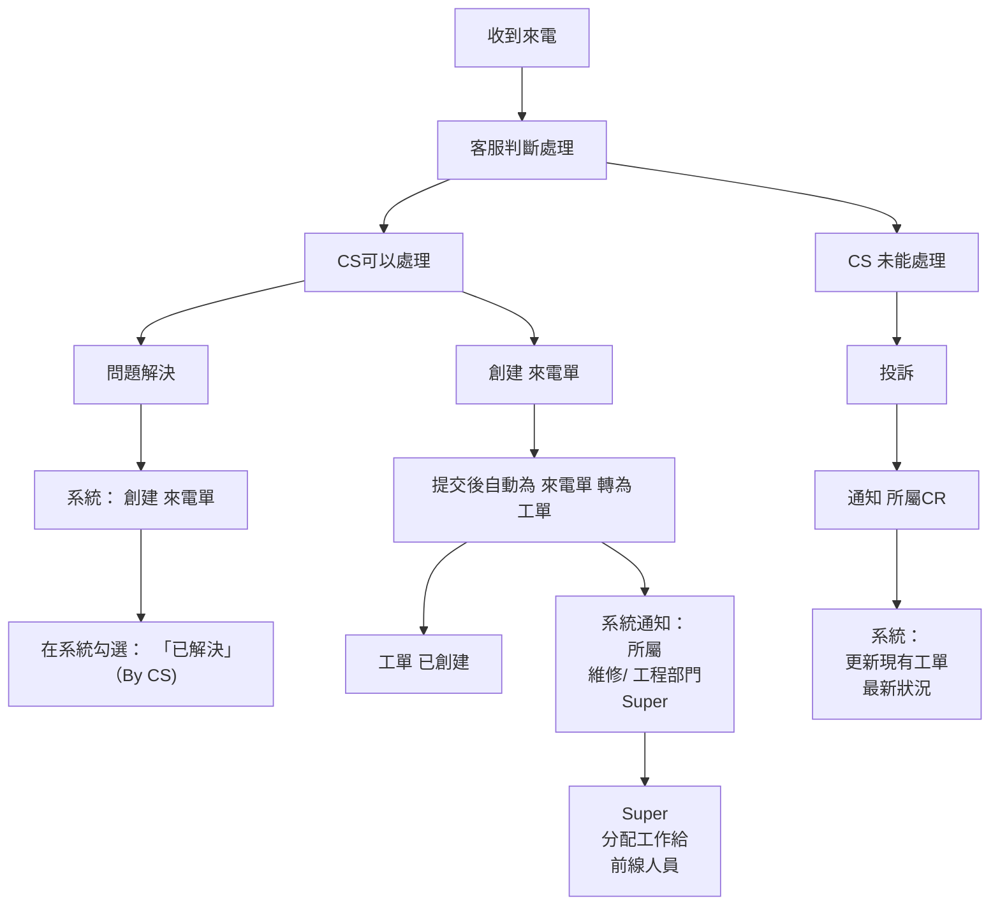
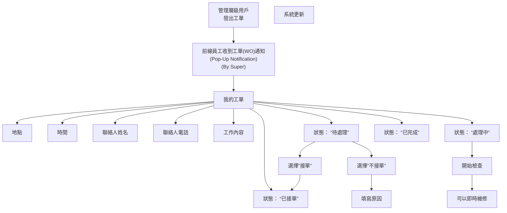
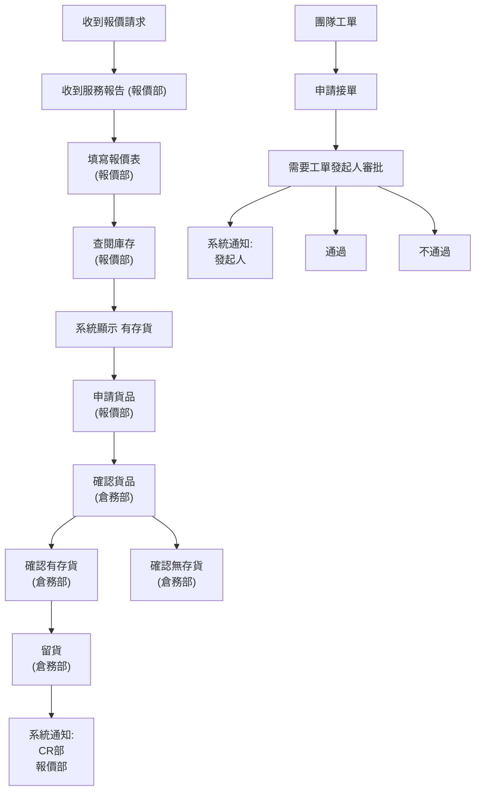
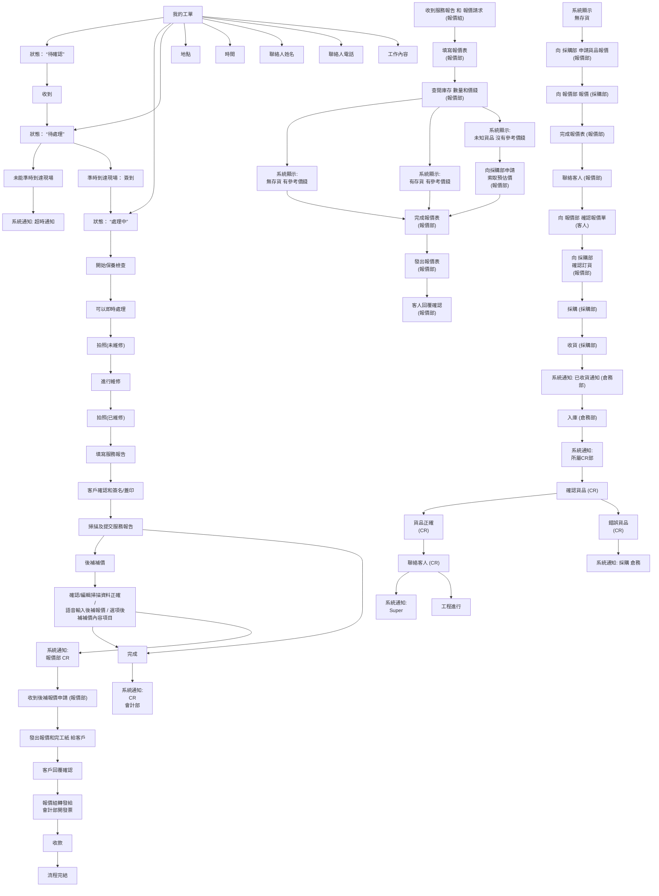
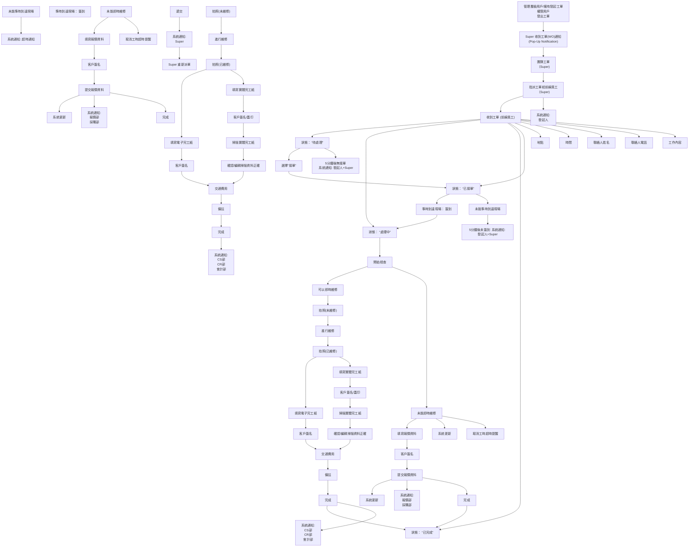
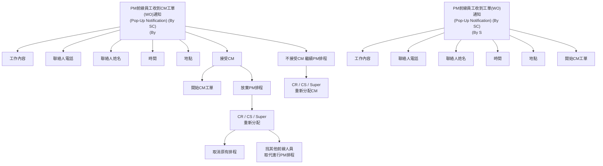

## CS Call (Customer Service Call Protocol)

节点: 15, 连线: 17

## PM (Field Maintenance: Preventive Maintenance)

节点: 18, 连线: 23

## Q2C (Quotation Dept: Service Report and Q2C)

节点: 17, 连线: 18

## Procurement (Procurement and Inventory Management)

节点: 61, 连线: 68

## Special (Field Maintenance: Special / Emergency Team)

节点: 71, 连线: 78

## CM (Field Maintenance: Corrective Maintenance (CM))

节点: 21, 连线: 23

