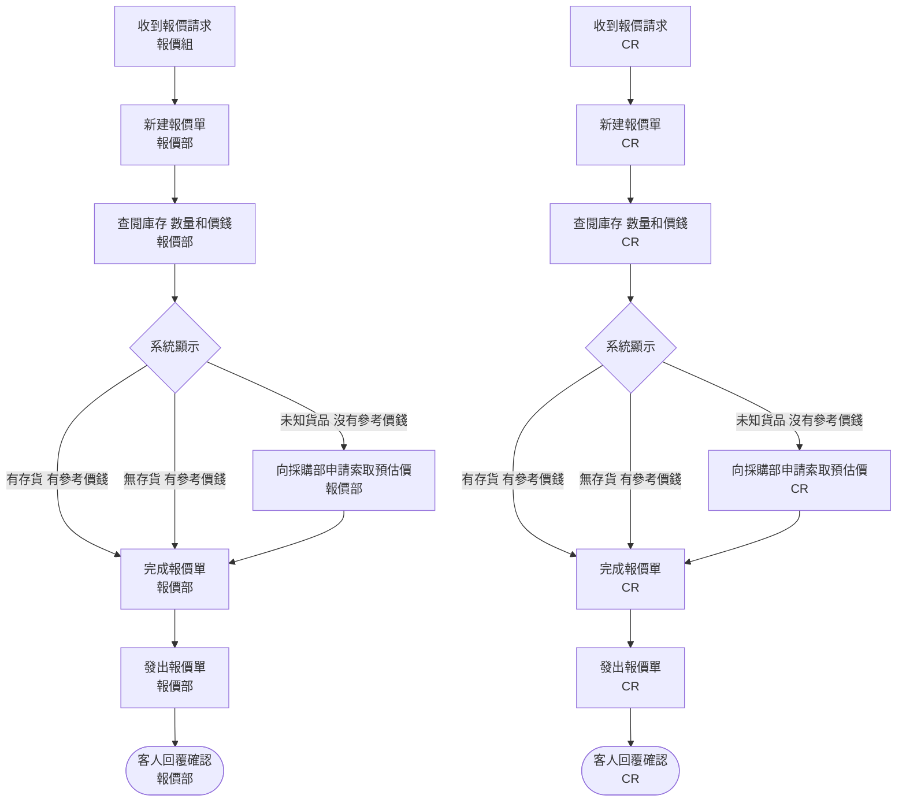
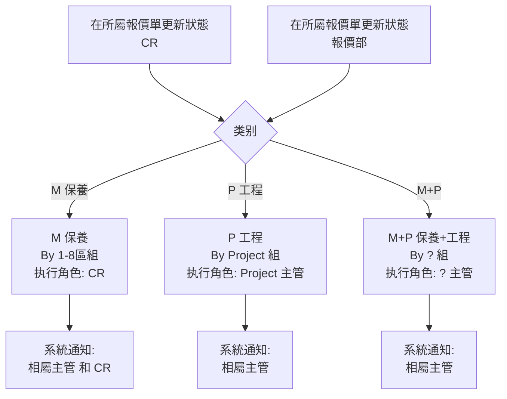
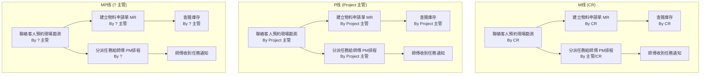
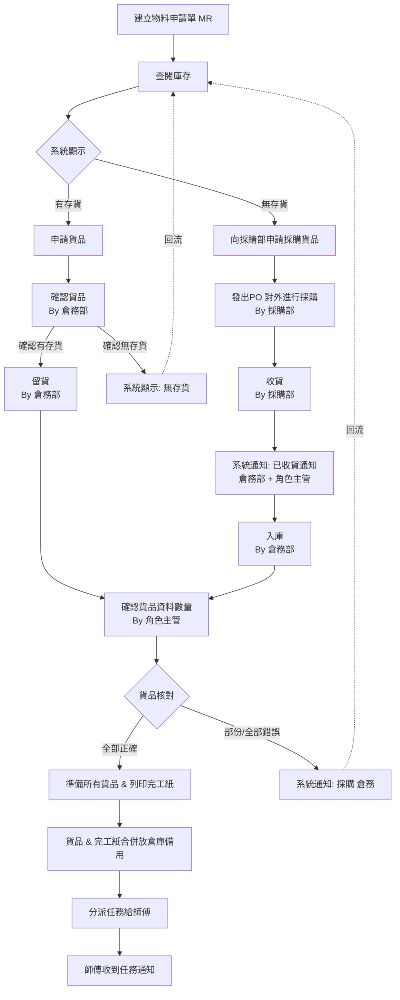
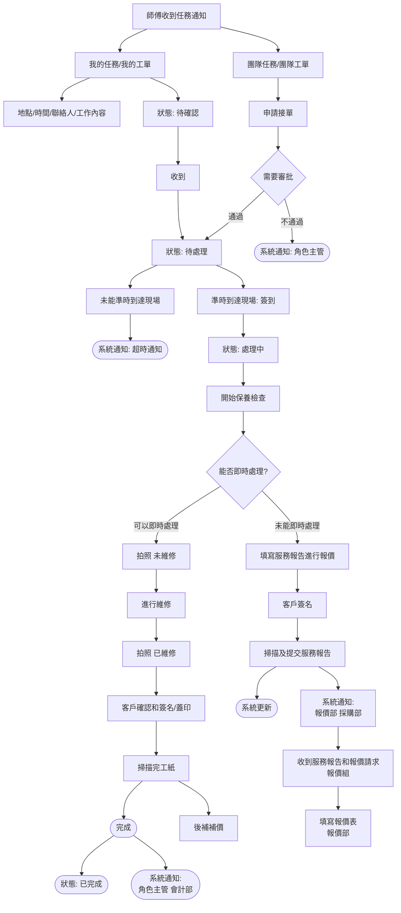
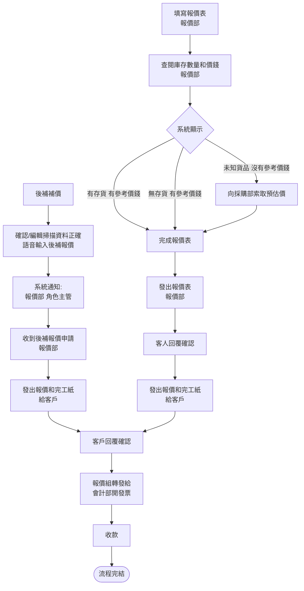
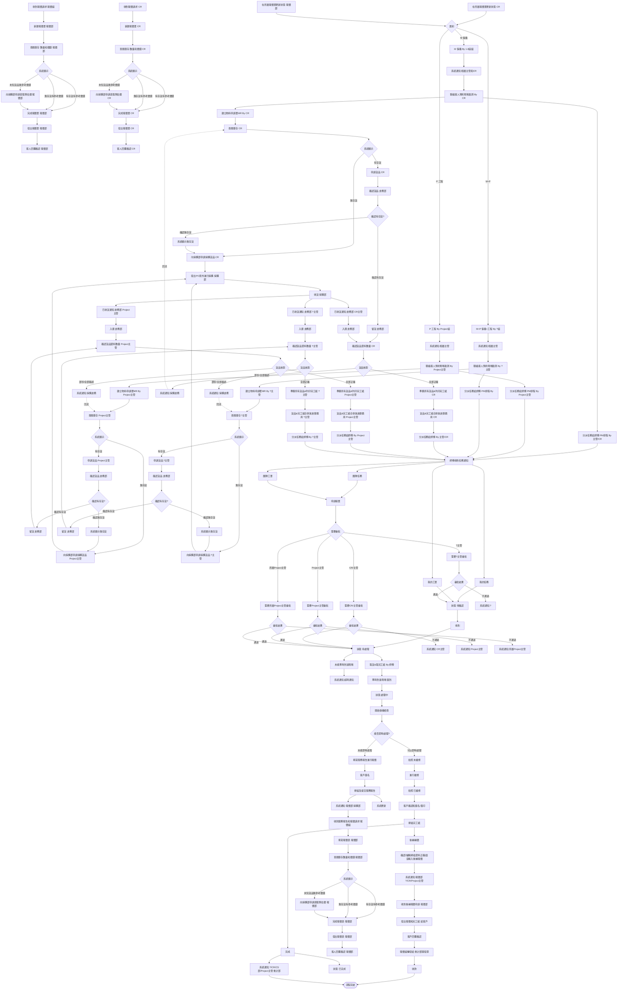

# 报价流程 - 可读版（基于业务逻辑理解）

## 4个入口

1. 收到報價請求 (報價組) → 新建報價單 (報價部)
2. 收到報價請求 (CR) → 新建報價單 (CR)
3. 在所屬報價單更新狀態 (CR) → M/P/MP三叉
4. 在所屬報價單更新狀態 (報價部) → M/P/MP三叉

## 阶段1: 报价单生成（入口1、2 - 报价请求路径）

> **关键**: 报价流程的库存判定是**三态**（有货有价/无货有价/未知无价），比标书流程多一态。

## 阶段2: 状态更新三叉（入口3、4 - 状态更新路径）

> **与标书流程的差异**: 标书流程的类别三叉入口是"匯入系統掃描標書"，报价流程是"在所屬報價單更新狀態"。

## 阶段3: 勘测 + 两条并行线路

> **关键**: 三条线在【聯絡客人預約現場勘測】后都有**两条并行线路**:
> 1. → 建立物料申請單MR → 查閱庫存（需要物料的备货路径）
> 2. → 分派任務給師傅PM排程 → 師傅收到任務通知（无需物料的直接执行路径）

## 阶段4: 备货流程（三条线同构，以M线为例）

## 阶段5: 现场执行（师傅侧，三条线共享）

## 阶段6: 后补报价 + 财务闭环

## 完整流程图（不拆分）

## 三条线的角色差异对照

| 节点 | M线 | P线 | MP线 |
|---|---|---|---|
| 类别 | M (保養) By 1-8區組 | P (工程) By Project組 | M+P By ?組 |
| 系统通知 | 相屬主管 **和 CR** | 相屬主管 | 相屬主管 |
| 勘测执行 | By CR | By Project 主管 | By ? 主管 |
| MR建立 | By CR | By Project 主管 | By ? 主管 |
| PM排程分派 | By 主管/CR | By Project 主管 | By ? |
| 查閱庫存 | By CR | By Project 主管 | By ? 主管 |
| 申請貨品 | By CR | By Project 主管 | By ? 主管 |
| 採購申請 | By CR | By Project 主管 | By ? 主管 |
| 確認貨品數量 | By CR | By Project 主管 | By ? 主管 |
| 準備貨品完工紙 | By CR | By Project 主管 | By ? 主管 |
| 分派師傅 | By 主管/CR | By Project 主管 | By ? 主管 |
| 團隊審批 | 需要CR/主管審批 | 需要Project主管審批 | 需要CR/主管審批 |
| 完成通知 | CR + 會計部 | Project主管 + 會計部 | ? + 會計部 |

## 与标书流程的核心差异

| 维度 | 标书流程 | 报价流程 |
|---|---|---|
| 入口数 | 2个（主动/被动寻找） | 4个（报价请求×2 + 状态更新×2） |
| 库存判定 | 二态（有/无） | **三态**（有货有价/无货有价/未知无价） |
| 状态更新入口 | 无 | **有**（在所屬報價單更新狀態 → M/P/MP三叉） |
| 财务闭环 | 无 | **有**（开发票→收款→完结） |
| 审批角色 | ?主管/CR/Project主管 | ?主管/CR/Project主管/所屬Project主管 |

> **结论**: 报价流程比标书流程多了"报价单生成"阶段（三态库存判定）和"财务闭环"阶段（开发票→收款→完结），其余阶段（类别三叉、勘测并行、备货、现场执行）完全同构。
