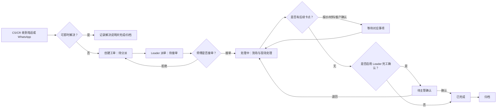

# EC 工单系统一期 MVP：详细功能规格

**版本**：v1.0
**状态**：待客户确认
**适用阶段**：HTML 原型确认、宜搭 POC、一期 MVP 实施准备
**范围基线**：[一期 MVP PRD](spec.md)；本文件补足模块、页面、字段和业务逻辑，不扩大已确认范围。

## 1. 规格使用说明

本文件是当前项目的功能规格主索引。评审时按以下顺序确认：

1. 先确认一期范围与角色权限；
2. 再确认每个页面的字段和操作；
3. 最后确认流转、异常和验收规则。

凡标记为“待确认”的内容，不得作为一期承诺或直接投入实施。项目来源、原始会议纪要与纸质表单索引见 [资料索引](../../abc/ec-workorder/00-materials-index.md)；完整实体字段定义见 [数据模型](../../abc/ec-workorder/05-data-model.md)。

## 2. 产品目标与边界

### 2.1 一期目标

替代纸质 `Daily Service Call Form` 和人工 WhatsApp 转派，建立“CS 建单 → Leader 派单 → 师傅执行 → 查询与追溯”的最小闭环。结果是每张未完成工单都能查到当前状态、责任人和卡点。

### 2.2 分期范围

| 优先级 | 纳入模块 | 一期边界 |
|---|---|---|
| P0 | 建单、编号、主数据、派单、师傅移动端、现场证据、状态流转、查询、权限日志、基础看板 | 必须完成并通过试点验收。 |
| P1 | 工单池、Outstanding 原因、超时提醒、简版报销关联 | 仅在客户书面确认且不影响 P0 时加入。 |
| P2 | 报价编号/状态、采购 PO/ML/到货状态字段 | 只预留字段与关联入口，不交付完整流程。 |
| 不做 | 完整报价/采购/仓库/报销审批、客户门户、WhatsApp 自动抓取、语音转写、实时定位、AI/OCR | 二期或三期候选，不能作为本期验收依据。 |

### 2.3 角色与数据范围

| 角色 | 可见数据 | P0 核心操作 |
|---|---|---|
| CS | 本人创建的工单及被授权跟进的工单 | 建单、补充、标记即时解决、查看状态。 |
| CR | 客户关系/投诉授权范围 | 建投诉工单、添加跟进、提出转派建议。 |
| Team Leader | 本团队/本区域 | 派单、改派、处理拒单、退回补充、确认完成。 |
| 师傅 | 本人已分派工单及启用后可接的工单池 | 接单、拒单、到场、上传、填写结果、提交。 |
| 报价/采购/财务 | 被授权的关联工单 | 维护各自的预留关联信息、查询和导出。 |
| 管理层 | 全局或获授权范围 | 看板、查询、导出，不修改现场记录。 |
| 管理员 | 全量 | 主数据、角色、编号和审计配置。 |

## 3. 模块清单

| 编号 | 模块 | 优先级 | 业务价值 | 主要角色 | 关键输出 | 来源 |
|---|---|---:|---|---|---|---|
| M01 | 工单受理与编号 | P0 | 消除漏单，替代纸质来电表 | CS、CR | 唯一工单号、待分派记录 | M6、I4 |
| M02 | 客户、地址与团队主数据 | P0 | 保证区域和人员推荐正确 | 管理员、CS 主管 | 标准客户/地址/区域/人员资料 | M4、I19 |
| M03 | 派单与异常处理 | P0 | 让责任人和拒单原因可追溯 | Leader、师傅 | 指派结果、拒单/改派记录 | M5、M6 |
| M04 | 师傅移动端执行 | P0 | 降低现场录入门槛，形成服务证据 | 师傅 | 到场、照片/豁免、处理结果 | M2、M4、M5 |
| M05 | 工单详情与流转记录 | P0 | 让各角色看到完整上下文 | 全角色 | 状态、时间线、附件和关联 | M5、M6 |
| M06 | 查询、看板与审计 | P0 | 让管理层识别状态、负责人和卡点 | CS、Leader、管理层、管理员 | 筛选列表、基础看板、操作日志 | M5、I5、I6 |
| M07 | Outstanding 与提醒 | P1 | 主动暴露等待材料、报价等卡点 | Leader、管理层 | Outstanding 原因、超时提醒 | M5、I5 |
| M08 | 简版报销关联 | P1 | 让费用单可追溯至已完成工单 | 师傅、Leader、财务 | 报销申请、关联工单、票据 | M4、M5 |
| M09 | 报价/采购关联预留 | P2 | 为后续报价和物料流程保留上下文 | 报价、采购、Leader | 报价、PO、ML、到货字段 | M4、M6 |

## 4. 页面清单与页面字段

### 4.1 PC 管理端

| 页面 ID | 页面 | 角色 | 目的 | 必要操作 | 优先级 |
|---|---|---|---|---|---:|
| P01 | 工单列表 | CS、CR、Leader、管理层等 | 快速定位并跟进工单 | 筛选、查看、导出；CS 可新建 | P0 |
| P02 | 新建/编辑工单 | CS、CR | 录入电话/WhatsApp 服务请求 | 保存草稿、提交、标记即时解决 | P0 |
| P03 | 工单详情 | 按数据权限 | 查看全量上下文与合法动作 | 详情、时间线、附件、状态操作 | P0 |
| P04 | Leader 派单工作台 | Leader | 将待分派工单交给合适师傅 | 派单、改派、查看拒单、退回 | P0 |
| P05 | 客户/地址管理 | 管理员、CS 主管 | 维护建单和派单依据 | 新增、编辑、停用、导入 | P0 |
| P06 | 团队/区域/角色配置 | 管理员 | 维护组织、技能和权限范围 | 配置团队、成员、Leader、范围 | P0 |
| P07 | 基础管理看板 | Leader、管理层 | 看状态与团队工作量 | 时间/区域筛选、下钻至工单 | P0 |
| P08 | 操作日志 | 管理员、审计 | 审计关键业务动作 | 条件筛选、查看日志 | P0 |
| P09 | Outstanding/超时 | Leader、管理层 | 处理未完成卡点 | 查看卡点、催办、下钻 | P1 |
| P10 | 报销关联 | 师傅、Leader、财务 | 记录费用与工单的关系 | 建单、上传、查询 | P1 |
| P11 | 报价/采购关联 | 报价、采购、Leader | 记录后续处理索引 | 填写关联字段、上传附件 | P2 |

### 4.2 移动端

移动端首屏仅保留“待接单、处理中、历史记录”三个入口；不展示 PC 后台配置菜单。

| 页面 ID | 页面 | 使用者 | 页面内容 | 主要操作 | 优先级 |
|---|---|---|---|---|---:|
| M01 | 我的待办 | 师傅 | 待接单、处理中、已退回数量与工单卡片 | 进入工单详情 | P0 |
| M02 | 移动工单详情 | 师傅 | 地点、联系人、问题、照片策略、当前状态 | 接单、拒单、到场、上传、提交 | P0 |
| M03 | 接单/拒单 | 师傅 | 工单摘要、拒单原因 | 确认接单或拒单 | P0 |
| M04 | 到场与现场证据 | 师傅 | 到场时间、位置文字/选点、照片分类 | 到场、拍照/相册上传、填写豁免 | P0 |
| M05 | 处理结果提交 | 师傅 | 处理结果、后续需要、备注 | 提交结果、提交待确认 | P0 |
| M06 | 我的历史 | 师傅 | 本人近期已完成/已取消工单 | 筛选、查看详情 | P0 |

### 4.3 页面字段明细

#### P01 工单列表

| 区域 | 字段/控件 | 规则 |
|---|---|---|
| 筛选区 | 关键词 | 匹配工单号、客户中英文名、地址中英文名、联系人电话、S/R 编号、外部参考号。 |
| 筛选区 | 创建时间、主状态、负责人、团队、区域、客户、PM/CM 类型 | 任意组合筛选；只能返回当前角色有权查看的数据。 |
| 列表 | 工单号、创建时间、客户、地点、类型、状态、Outstanding 原因、当前负责人、停留时长 | 默认按未完成优先、最新创建时间倒序。 |
| 操作 | 新建、查看、导出 | 导出动作必须记入操作日志；师傅无此页面。 |

#### P02 新建/编辑工单

| 分组 | 字段 | 必填 | 规则 |
|---|---|---:|---|
| 来源 | 来源渠道、来电时间、Call Code、外部参考号、来电附件 | 渠道/时间必填 | 渠道：电话、WhatsApp、系统录入、其他；创建人和创建时间自动记录。 |
| 分类 | 工单类型、业务类型、优先级 | 类型、业务类型必填 | 类型：PM、CM、投诉、其他；优先级默认普通。 |
| 客户 | 客户、联系人、联系电话 | 是 | 客户从主数据选取；联系人和电话可从客户档案带出后修改。 |
| 地点 | 地址、区域码、项目/合约 | 地址、区域码必填 | 地址带出区域码、默认团队和默认 Leader；缺失时禁止自动派单。 |
| 需求 | 问题描述、期望到场时间、附件 | 问题描述必填 | 描述应使 Leader 可以派单；附件可选。 |
| 分派建议 | 推荐团队、推荐 Leader | 否 | 按地址/区域配置带出，可由授权人调整。 |
| 即时解决 | 是否即时解决、即时解决说明 | 条件必填 | 选择“是”时说明必填，工单不进入派单。 |

#### P03 工单详情

| 页签 | 字段/内容 | 可执行操作 |
|---|---|---|
| 基本信息 | P02 全部字段、工单号、项目编号、当前状态、当前负责人 | CS 在未派单前可补充；其他修改受状态和权限控制。 |
| 执行信息 | 到场时间、位置、处理结果、处理子状态、需报价/材料/客户确认 | 师傅填报；Leader 可退回补充或确认完成。 |
| 现场证据 | 照片/附件分类、上传人、上传时间、豁免原因 | 师傅上传；可拍照工单依据规则校验。 |
| 流转时间线 | 动作、前后状态、操作者、时间、原因/备注 | 只读、不可手工篡改。 |
| 后续关联 | 报价编号/状态/负责人、PO/ML/到货、报销关联 | P2/P1 依优先级显示，不构成完整子系统。 |

#### P04 Leader 派单工作台

| 分组 | 字段/控件 | 规则 |
|---|---|---|
| 待派列表 | 工单号、优先级、地点、类型、问题摘要、推荐团队/Leader、停留时长 | 仅显示本区域/团队可处理的“待分派”工单。 |
| 师傅选择 | 团队、师傅、技能标签、当前待接/处理中数量 | 仅可选择有效、具备权限的成员；技能仅作推荐，Leader 可手动决定。 |
| 派单信息 | 指派原因、预计到场时间、通知对象 | 指派后必须记录指派人和时间，通知师傅。 |
| 异常区 | 最近拒单原因、历史指派记录、退回原因 | 拒单后可重新选择师傅；不能覆盖历史原因。 |
| 完工核查 | 照片/豁免、处理结果、后续需求 | 若启用 Leader 确认，提供“确认完成/退回补充”。 |

#### P05-P06 主数据配置

| 页面 | 字段 | 核心规则 |
|---|---|---|
| 客户 | 中文标准名、英文别名、客户类型、默认联系人、电话、影像策略、特殊进入说明、启用状态 | 客户名与别名参与搜索；不可拍照/需审批策略会带入新工单。 |
| 地址 | 屋苑/地点中英文名、完整地址、行政区、区域码、默认团队、默认 Leader、选点 | 新地址必须有区域码；无默认 Leader 时明确标注“待人工分派”。 |
| 团队 | 团队名称、负责区域、Leader、成员、技能标签、启用状态 | 一个成员可有多个技能；停用成员不能被派新单。 |
| 角色 | 人员、角色、默认团队、数据范围、启用状态 | 所有关键操作按个人 ID 记录；禁用账号不删除历史记录。 |

#### M02-M05 师傅移动端

| 操作步骤 | 显示字段 | 输入字段 | 提交校验 |
|---|---|---|---|
| 查看待办 | 工单号、优先级、地点、问题摘要、待接/处理中标识 | 无 | 只展示本人有权操作的工单。 |
| 接单/拒单 | 客户、地点、问题、预计时间 | 拒单原因 | 接单无需额外文本；拒单原因必填。 |
| 到场 | 地址、联系人、照片策略 | 到场时间、位置文字/选点 | 记录一次到场事件；不采集实时轨迹。 |
| 上传证据 | 工单号、可否拍照、已上传数量 | 分类：现场前/后、故障细节、材料设备、其他；文件、说明 | 不可拍照时不强制照片，但豁免原因与替代证明说明必填。 |
| 提交结果 | 当前状态、已上传证据、待办后续项 | 处理结果、子状态、需报价、需材料、需客户确认、备注 | 处理结果必填；可拍照且 `photo_required=是` 时需满足照片或授权豁免。 |

## 5. 关键字段目录

以下是 P0 评审字段；系统字段、审计字段和 P1/P2 预留字段分别注明。字段名以业务含义为准，实际低代码配置可采用对应英文编码。

| 实体 | 字段 | 必填 | 说明/取值 | 优先级 |
|---|---|---:|---|---:|
| 工单 | 工单号 | 是 | 普通小区类与政府合约类使用不同、待确认的编号规则；唯一且可搜索。 | P0 |
| 工单 | 工单类型 | 是 | PM、CM、投诉、其他。 | P0 |
| 工单 | 业务类型 | 是 | 小区类、政府合约类、商业/私营、待确认。 | P0 |
| 工单 | 来源渠道、来电时间、Call Code | 渠道/时间是 | 电话、WhatsApp、系统录入、其他；保留现有 Call Code。 | P0 |
| 工单 | 客户、联系人、联系电话、地址、区域码 | 是 | 从主数据带出并允许当前工单快照修改。 | P0 |
| 工单 | 问题描述、优先级、期望到场时间 | 描述是 | 优先级：普通、紧急、待确认。 | P0 |
| 工单 | 当前状态、处理中子状态、Outstanding 原因 | 状态是 | 状态与可操作按钮必须一致；Outstanding 原因为 P1。 | P0/P1 |
| 工单 | 指派团队、Leader、师傅 | 否 | 随派单/改派变化，保留每次变更日志。 | P0 |
| 工单 | 可否拍照、照片是否必需、未拍照原因 | 策略是 | 从客户档案带入；豁免原因按规则必填。 | P0 |
| 工单 | 到场、开始、提交、确认、完成、归档时间 | 否 | 由对应业务动作写入，不允许任意手工覆盖。 | P0 |
| 工单 | 即时解决说明、取消原因、最近拒单原因 | 条件必填 | 即时解决/取消/拒单时必须填写原因或说明。 | P0 |
| 工单 | 项目号、S/R 号、外部参考号 | 否 | 支持查询与后续报价/采购关联。 | P0/P2 |
| 流转记录 | 动作、前状态、后状态、操作者、时间、备注/原因 | 是 | 每次创建、派单、接单、拒单、到场、上传、提交、退回、完成、取消、归档均生成。 | P0 |
| 流转记录 | 到场地点文字、选点 | 否 | 只记录到场，不做实时轨迹。 | P0 |
| 附件 | 文件、附件分类、上传人、上传时间、说明 | 文件/分类是 | 分类：现场前、现场后、故障细节、材料设备、员工纸、完成单、其他。 | P0 |
| 客户 | 中文标准名、英文别名、类型、默认联系人/电话 | 名称是 | 用于中英文搜索和默认带入。 | P0 |
| 客户 | 影像策略、特殊进入说明、启用状态 | 是 | 可拍照、不可拍照、需审批、待确认。 | P0 |
| 地址 | 中英文地点名、完整地址、区域码、默认团队/Leader | 地址/区域是 | 区域与 Leader 是派单推荐的依据。 | P0 |
| 团队/角色 | 团队、区域、Leader、成员、技能、角色、数据范围、启用状态 | 是 | 数据范围：本人、本团队、本区域、全公司。 | P0 |
| 报销 | 申请人、月份、关联工单、类型、金额、票据、状态 | 条件必填 | 多关联已完成工单；仅 P1 简版。 | P1 |
| 报价 | 报价号、状态、负责人、附件、金额 | 否 | 仅预留，不做明细、版本和 PDF。 | P2 |
| 采购 | PO 号、ML 号、材料说明、预计/实际到货、状态、附件 | 否 | 仅预留，不做库存或收货流程。 | P2 |

## 6. 业务流程与状态规则

### 6.1 主流程

### 6.2 状态转换矩阵

| 当前状态 | 允许动作 | 执行角色 | 目标状态 | 必填校验 | 通知/记录 |
|---|---|---|---|---|---|
| 草稿/新建 | 提交需处理工单 | CS、CR | 待分派 | 客户、联系人、电话、地址、区域、类型、业务类型、问题描述 | 创建事件；推荐 Leader 可见。 |
| 草稿/新建 | 标记即时解决 | CS、CR | 已完成或已归档 | 即时解决说明 | 解决事件；不生成师傅待办。 |
| 待分派 | 指派师傅 | Leader | 待接单 | 有效师傅、团队符合授权 | 派单事件；通知师傅。 |
| 待接单 | 接单 | 师傅 | 处理中 | 当前指派人为本人 | 接单事件；通知 Leader/CS。 |
| 待接单 | 拒单 | 师傅 | 待分派 | 拒单原因 | 拒单事件；通知 Leader/CS。 |
| 处理中 | 记录到场 | 师傅 | 处理中 | 到场时间 | 到场事件，写入时间与可选地点。 |
| 处理中 | 提交处理结果 | 师傅 | 待主管确认或已完成 | 处理结果；照片/豁免规则通过 | 提交事件；通知 Leader。 |
| 处理中 | 标记等待报价/材料/客户确认 | 师傅、Leader | 对应等待状态 | 选择原因，必要时填写说明 | 状态事件；通知责任角色。 |
| 等待报价/材料/客户确认 | 恢复处理 | Leader、获授权责任人 | 处理中 | 卡点已解除说明 | 恢复事件。 |
| 待主管确认 | 确认完成 | Leader | 已完成 | 检查处理结果与照片/豁免 | 确认事件；写入确认/完成时间。 |
| 待主管确认 | 退回补充 | Leader | 处理中 | 退回原因 | 退回事件；通知师傅。 |
| 非归档状态 | 取消 | CS、Leader（授权） | 已取消 | 取消原因 | 取消事件；停止后续履约动作。 |
| 已完成/已取消 | 归档 | 财务、Leader、管理员（授权） | 已归档 | 无未关闭的 P0 必填项 | 归档事件，保留只读追溯。 |

### 6.3 核心业务规则

| 编号 | 规则 | 适用模块 | 验收口径 | 来源/确认状态 |
|---|---|---|---|---|
| BR-01 | 每个需现场处理的请求只能生成一个唯一工单号；项目号可关联但不能替代工单号。 | M01 | 普通和政府样例各 1 单编号唯一、可查询。 | M4、M6；政府前缀待确认。 |
| BR-02 | 客户/地址带出区域码、默认团队和 Leader；缺任一推荐依据时只能待人工分派，不能错误自动派给人员。 | M02、M03 | 缺少映射的工单不产生错误指派。 | M4、I19。 |
| BR-03 | 拒单、改派、退回、取消必须填写原因；新动作不得覆盖历史记录。 | M03、M05 | 时间线可看到人、时间、原因和前后状态。 | M5、M6。 |
| BR-04 | 师傅只能处理本人被派的工单；无法查看非授权客户、团队或区域的数据。 | M04、M06 | 权限测试中师傅看不到他人未授权工单。 | M5、M6。 |
| BR-05 | 可拍照且要求照片的工单，提交结果前必须有合规照片；不可拍照时必须填写豁免和替代证明说明。 | M04、M05 | 各用一单可拍照和不可拍照工单完成验证。 | M5、I11、I12。 |
| BR-06 | 到场仅保存一次或多次到场事件的时间与选点/文字；不采集实时轨迹。 | M04 | 详情能看到到场时间；无轨迹功能。 | M2、M6。 |
| BR-07 | Leader 完工确认开关在试点前配置；未启用时，师傅合规提交可直接完成；启用时必须经待主管确认。 | M03、M05 | 两种配置均能按矩阵流转。 | M4、M5；待客户确认。 |
| BR-08 | 报价、采购、报销状态只能作为工单后续卡点/关联，不得在 P0 中演变为完整独立审批或库存流程。 | M07-M09 | P0 验收不依赖这些模块。 | MVP 范围基线。 |
| BR-09 | 所有导出、创建、派单、接单、拒单、上传、状态变更、确认、取消、归档使用个人 ID 留痕；账号禁用后保留历史快照。 | M05、M06 | 日志可筛选并保留操作人/时间。 | M3、M5、M6。 |
| BR-10 | 照片数量、大小、在线保存期限在 POC 以真实手机和网络验证后配置；当前不得将任何容量数字视为已确认承诺。 | M04、M06 | POC 输出容量与归档策略。 | M1；待 POC。 |

## 7. 通知、异常与数据质量

### 7.1 通知事件

| 事件 | 接收人 | 最低通知内容 |
|---|---|---|
| 新工单进入待分派 | 推荐 Leader、CS | 工单号、地点、类型、问题摘要、优先级。 |
| Leader 派单 | 指定师傅 | 工单号、地点、联系人、问题、预计时间、照片限制。 |
| 师傅拒单 | Leader、创建 CS | 工单号、拒单原因、时间。 |
| 师傅提交结果 | Leader | 工单号、处理摘要、照片/豁免情况、后续需求。 |
| 进入等待报价/材料/客户确认 | 对应负责人、Leader | 工单号、卡点、下一步责任。 |
| 超时（P1） | Leader，必要时上级 | 工单号、状态、停留时长、当前责任人。 |

### 7.2 异常处理

| 场景 | 系统处理 | 责任人 |
|---|---|---|
| 找不到客户/地址 | CS 临时录入必要快照或提交主数据补充；工单标注待人工分派。 | CS、管理员。 |
| 区域/Leader 映射缺失 | 禁止自动指派，进入 Leader/管理员人工处理队列。 | Leader、管理员。 |
| 师傅拒单 | 工单回到待分派，保存原因，Leader 再派。 | 师傅、Leader。 |
| 照片上传失败 | 保留失败提示与重试入口；未满足必填校验时不得提交完成。 | 师傅。 |
| 特殊场所不可拍照 | 显示限制，改校验豁免原因与替代证明。 | 师傅、Leader。 |
| 政府编号规则未配置 | 不允许按猜测生成正式编号；由管理员配置后才可提交相应类型。 | 管理员。 |
| 取消后仍有人尝试执行 | 不显示现场执行按钮，保留已取消原因和历史记录。 | 系统规则。 |

## 8. 验收与待确认事项

### 8.1 P0 验收场景

| 编号 | 场景 | 通过标准 |
|---|---|---|
| AT-01 | CS 建普通工单 | 3 分钟内完成必填信息，得到唯一编号、待分派状态和推荐 Leader。 |
| AT-02 | 政府合约建单 | 已配置编号规则时生成正确唯一编号；未配置时系统阻止错误提交并提示配置。 |
| AT-03 | 派单、拒单、改派 | 师傅收到待办；拒单原因、改派人和时间都可在详情时间线追溯。 |
| AT-04 | 可拍照现场闭环 | 师傅接单、到场、上传合规照片、填结果、提交；状态按配置完成或待确认。 |
| AT-05 | 不可拍照现场闭环 | 师傅无需上传照片，但提交前必须填豁免及替代证明说明。 |
| AT-06 | 权限与查询 | 师傅仅见自身授权数据；Leader 仅操作本范围工单；管理人员能按组合条件找到目标工单。 |
| AT-07 | 日志与看板 | 工单全流程动作可追溯；基础看板与列表统计口径一致。 |

### 8.2 客户确认清单

| 编号 | 待确认项 | 不确认的影响 |
|---|---|---|
| CQ-01 | PM 与 CM 的业务边界及子类型 | 类型枚举、派单规则和报表口径无法冻结。 |
| CQ-02 | 普通/政府工单编号完整规则及政府前缀 | 政府工单不能安全上线。 |
| CQ-03 | 区域—团队—Leader—师傅映射及技能标签 | 自动推荐与派单无法验证。 |
| CQ-04 | Leader 是否必须确认完工 | 影响状态终点和师傅闭环时效。 |
| CQ-05 | 不可拍照客户/项目清单与替代证明要求 | 影响移动端必填校验。 |
| CQ-06 | 钉钉/宜搭许可、近 800 人账号安排、附件容量 | 是 POC 与生产上线前置条件。 |
| CQ-07 | P1 是否启用工单池、Outstanding、超时提醒、简版报销 | 防止一期范围在实施中膨胀。 |

## 9. 关联文档

- [一期 MVP PRD](spec.md)：目标、用户故事、范围与成功标准。
- [数据模型](../../abc/ec-workorder/05-data-model.md)：完整实体和字段定义。
- [字段映射](../../abc/ec-workorder/05A-field-mapping.md)：纸质/Excel 字段来源。
- [页面清单](../../abc/ec-workorder/06-page-list.md)：原始页面范围。
- [待确认问题](../../abc/ec-workorder/08-open-questions.md)：冲突与客户确认项。
- [客户确认范围](../../abc/ec-workorder/10-client-confirmation.md)：用于对外冻结范围。
