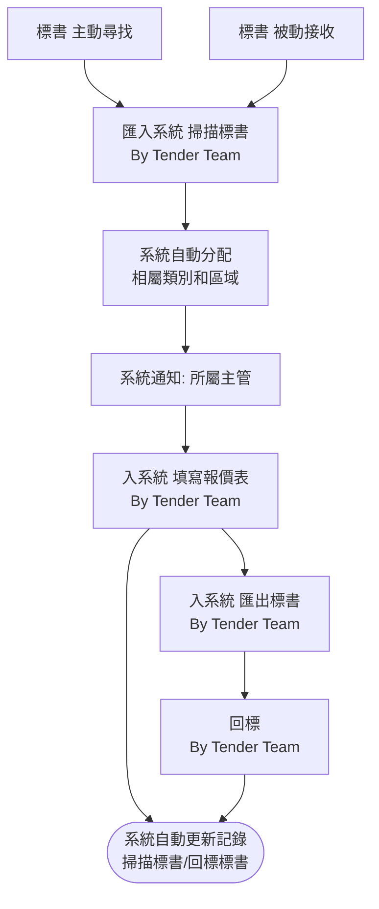
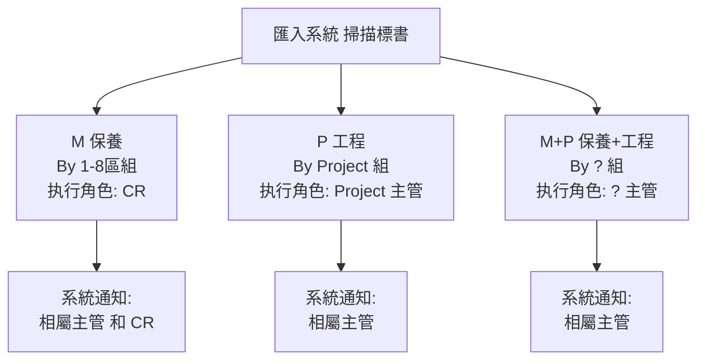
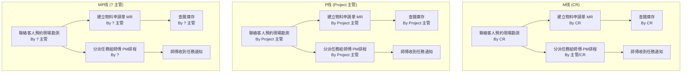
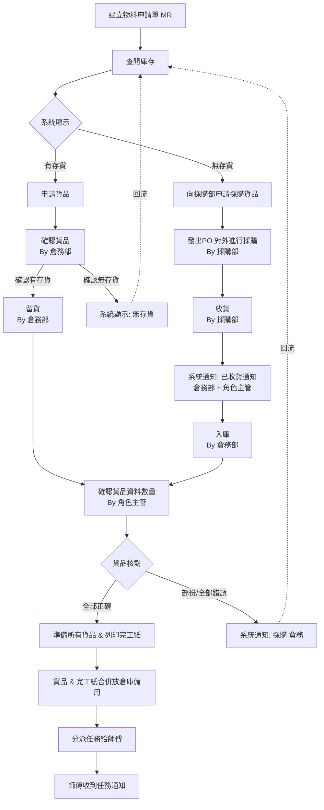
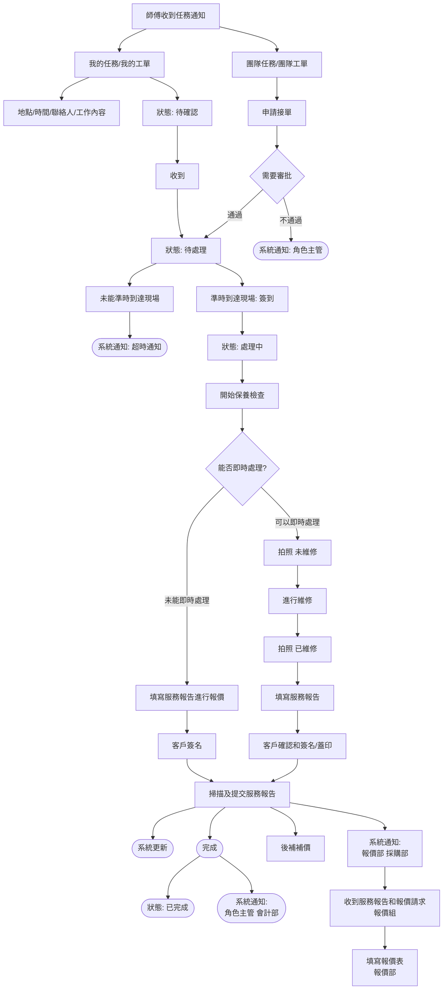
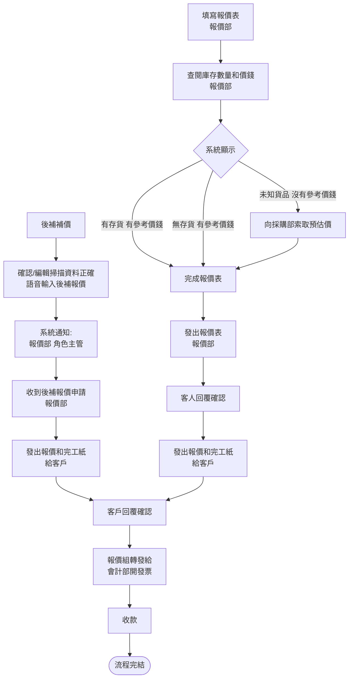

# 标书流程 - 可读版（基于业务逻辑理解）

## 阶段1: 标书录入与回标

## 阶段2: 类别三叉（中标后执行段）

## 阶段3: 勘测 + 两条并行线路

> **关键**: 三条线在【聯絡客人預約現場勘測】后都有**两条并行线路**:
> 1. → 建立物料申請單MR → 查閱庫存（需要物料的备货路径）
> 2. → 分派任務給師傅PM排程 → 師傅收到任務通知（无需物料的直接执行路径）

## 阶段4: 备货流程（三条线同构，以M线为例）

## 阶段5: 现场执行（师傅侧，三条线共享）

## 阶段6: 后补报价 + 财务闭环

## 三条线的角色差异对照

| 节点 | M线 | P线 | MP线 |
|---|---|---|---|
| 类别 | M (保養) By 1-8區組 | P (工程) By Project組 | M+P By ?組 |
| 系统通知 | 相屬主管 **和 CR** | 相屬主管 | 相屬主管 |
| 勘测执行 | By CR | By Project 主管 | By ? 主管 |
| MR建立 | By CR | By Project 主管 | By ? 主管 |
| PM排程分派 | By 主管/CR | By Project 主管 | By ? |
| 查閱庫存 | By CR | By Project 主管 | By ? 主管 |
| 申請貨品 | By CR | By Project 主管 | By ? 主管 |
| 採購申請 | By CR | By Project 主管 | By ? 主管 |
| 確認貨品數量 | By CR | By Project 主管 | By ? 主管 |
| 準備貨品完工紙 | By CR | By Project 主管 | By ? 主管 |
| 分派師傅 | By 主管/CR | By Project 主管 | By ? 主管 |
| 團隊審批 | 需要CR/主管審批 | 需要Project主管審批 | 需要CR/主管審批 |
| 完成通知 | CR + 會計部 | Project主管 + 會計部 | ? + 會計部 |

> **结论**: 三条线的业务流程**完全同构**，唯一差异是执行角色（CR / Project 主管 / ? 主管）。
> M线的系统通知多了"和CR"，MP线的PM排程分派标注为"By ?"（无"主管"字样）。
