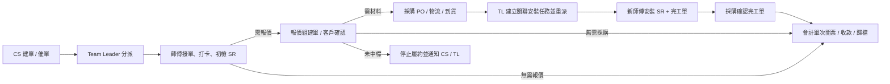
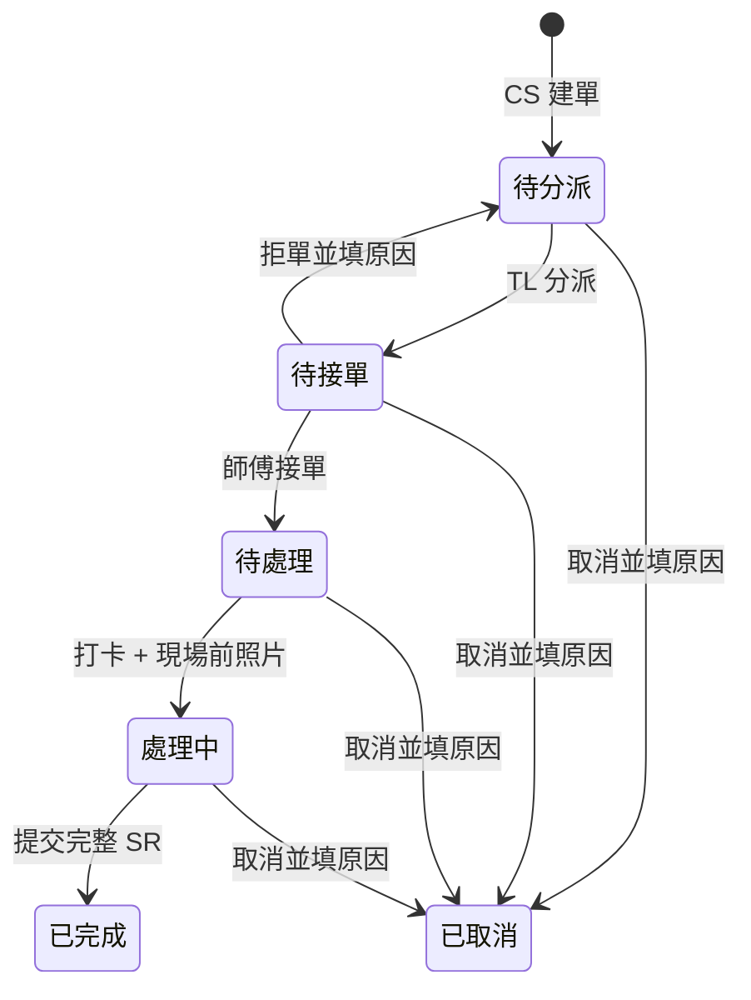

# EC 工單系統 v2 流程確認包

本原型以「主工單 6 狀態 + 平行履約軌 + 關聯執行任務」完成全鏈路演示。頁面內的「流程確認包」與下列圖稿內容一致。

## 01 全角色泳道

報價確認分支：客戶確認後，依「需要採購／無需採購」分流；客戶未中標則停止履約、不建立採購單，並通知 CS 與 Team Leader。

## 02 主工單 6 狀態

## 03 關聯資料

所有資料以 `WorkOrder.id` 和 `Project Reference` 關聯：

`WorkOrder` → `ServiceReport(初檢)` → `Quotation` → `PurchaseOrder` → `ExecutionTask` → `ServiceReport(安裝)` / `Completion Paper` → `Invoice` → `Payment` → `TimelineEvent`

## 04 消息事件

| 觸發 | 接收人 | 跳轉目標 |
|---|---|---|
| CS 建單 | Team Leader | 待分派工單 |
| 分派 / 改派 | 指定師傅 | 移動端待辦 |
| 接單、拒單、到場 | Team Leader | 分派中心 |
| 初檢 SR 需報價 | 報價組 | 報價工作台 |
| 報價確認 | 採購部 / 會計部 | 採購或財務工作台 |
| 物流到貨 | Team Leader | 關聯安裝任務 |
| 完工單確認 | 會計部 | 待開票發票 |
| 開票 / 收款 | CS、TL、老闆 | 關聯工單與經營看板 |
| 報價未中標 | CS、TL | 關聯工單與結果追蹤 |
